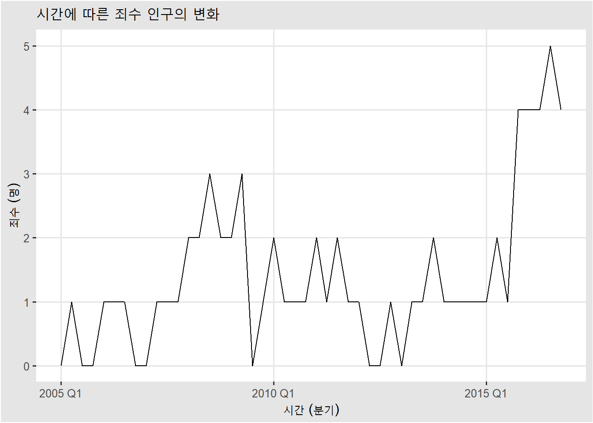
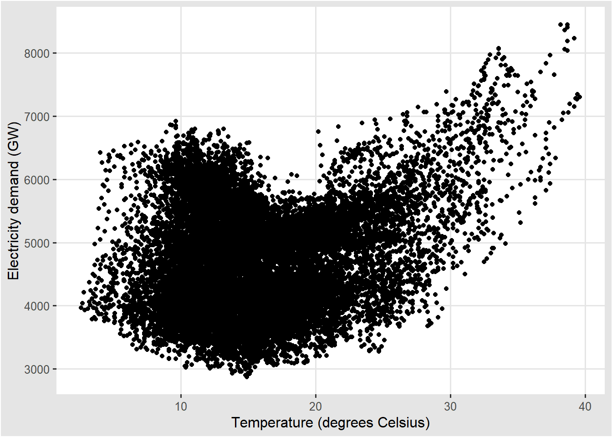
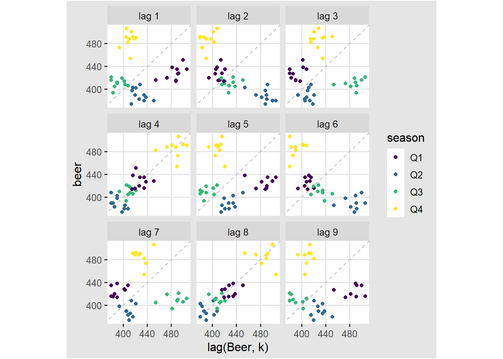
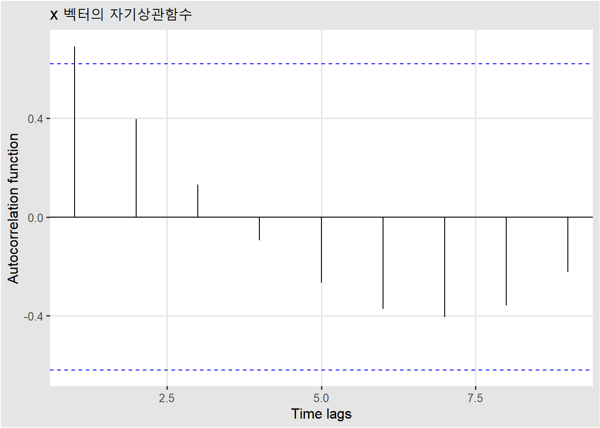

# 시계열 첫걸음, 관련 패키지의 이해 {#intro}

## `tsibble`, `feasts` 그리고 `fable` 패키지

시계열과 관련 된 R 패키지는 정말 많이 있다. 그 중에서 가장 유명한 패키지는 `forecast` 패키지이다. `fpp` 2판에서 메인 패키지로 활용되었던 `forecast` 패키지는 예측성능이 좋기로 유명하다. 하지만 `forecast`는 base 패키지를 기반으로 짜여져있는 패키지라서 `fpp` 3판에서 사용하게 될 패키지는 `tsibble`과 `feasts`, 그리고 `fable` 패키지를 주로 사용하게 될 예정이다. 세가지 패키지 모두 `tidyverse`스러운 코딩과 잘 맞는 함수들을 지원하는 것이 특징이다.

<div class="rmdwarning">
<h3 id="주의하기">주의하기</h3>
<p><code>forecast</code> 패키지는 다른 언어를 사용하는 커뮤니티에도 알려질 정도로 잘 짜여진 패키지이다. 꼭 한번은 사용법을 알아둘 것을 추천한다. <a href="https://otexts.com/fppkr/"><code>fpp</code> 2판의 한글판</a>을 봐두는 것도 나쁘지 않는 선택이다.</p>
</div>

* `tsibble` 패키지는 `tidyverse`의 대표 객체인 `tibble`을 시계열 데이터를 잘 다룰수 있도록 조정한 `tsibble` 객체를 지원한다. 

* `feasts` 패키지는 `Feature Extraction And Statistics for Time Series`의 줄임말로 시계열 데이터에서 특징을 뽑아내는데 사용된다. acf 함수라던지 lag 그래프를 그리는데에 사용된다.

* `fable`은 시계열 모델링에 관한 함수들이 모여져 있는 패키지이다. ARIMA, ETS와 같은 모델링 함수들을 가지고 있다.

## `fpp3` 패키지

`fpp3` 패키지는 Hyndman 교수와 Athanasopoulos 교수가 지은 Forecasting: principles and practice 3판에 딸림 R 패키지라고 생각하면 된다. `fpp3` 패키지를 로드시키면 앞에서 말했던 `tsibble`과 `feasts`, 그리고 `fable` 패키지가 같이 로드된다.


```r
library(fpp3)
```

## tsible 객체


```r
y <- tsibble(
  year = 2015:2019,
  observation = c(123, 39, 78, 52, 110),
  index = year
)
y
```

```
#> # A tsibble: 5 x 2 [1Y]
#>    year observation
#>   <int>       <dbl>
#> 1  2015         123
#> 2  2016          39
#> 3  2017          78
#> 4  2018          52
#> 5  2019         110
```

`tibble` 객체를 확장 시킨 `tidyverse`용 데이터 프레임. y변수를 선언할 때 어떤 열을 `index`로 할 것인지 선언해 줌. `[1Y]`라는 것을 보고 관찰값이 1년 단위 관측되었다는 것을 알 수 있음.

`tsibbledata` 패키지에 들어있는 `olympic_running` 데이터를 살펴보자.


```r
olympic_running
```

```
#> # A tsibble: 312 x 4 [4Y]
#> # Key:       Length, Sex [14]
#>     Year Length Sex    Time
#>    <int>  <int> <chr> <dbl>
#>  1  1896    100 men    12  
#>  2  1900    100 men    11  
#>  3  1904    100 men    11  
#>  4  1908    100 men    10.8
#>  5  1912    100 men    10.8
#>  6  1916    100 men    NA  
#>  7  1920    100 men    10.8
#>  8  1924    100 men    10.6
#>  9  1928    100 men    10.8
#> 10  1932    100 men    10.3
#> # ... with 302 more rows
```

위의 결과값을 보면 key 변수가 2개 (Length, Sex) 로 설정이 되어있고, `[14]`라는 표시가 보인다. 이것은 두 개의 변수가 갖는 unique한 값들로 조합 할 수 있는 경우의 수가 14가지 경우가 된다는 것을 의미한다.

다음을 살펴보자.


```r
olympic_running %>% 
  distinct(Length)
```

```
#> # A tibble: 7 x 1
#>   Length
#>    <int>
#> 1    100
#> 2    200
#> 3    400
#> 4    800
#> 5   1500
#> 6   5000
#> 7  10000
```

```r
olympic_running %>% 
  distinct(Sex)
```

```
#> # A tibble: 2 x 1
#>   Sex  
#>   <chr>
#> 1 men  
#> 2 women
```

## csv 파일로부터 `tsibble` 객체 만들기 연습


```r
prison <- readr::read_csv("https://OTexts.com/fpp3/extrafiles/prison_population.csv")
head(prison)
```

```
#> # A tibble: 6 x 6
#>   Date       State Gender Legal     Indigenous Count
#>   <date>     <chr> <chr>  <chr>     <chr>      <dbl>
#> 1 2005-03-01 ACT   Female Remanded  ATSI           0
#> 2 2005-03-01 ACT   Female Remanded  Non-ATSI       2
#> 3 2005-03-01 ACT   Female Sentenced ATSI           0
#> 4 2005-03-01 ACT   Female Sentenced Non-ATSI       5
#> 5 2005-03-01 ACT   Male   Remanded  ATSI           7
#> 6 2005-03-01 ACT   Male   Remanded  Non-ATSI      58
```

`prison` 변수에는 csv 파일로부터 불러온 시계열 정보가 들어있다. 날짜정보가 들어있는 첫번째 열을 인덱스로, count 정보를 제외한 나머지 열들을 key로 설정하여 tsibble로 바꿔보도록 하자.


```r
prison %<>% 
  janitor::clean_names() %>% 
  mutate(quarter = yearquarter(date),
         .keep = "unused") %>% 
  as_tsibble(key = state:indigenous,
             index = quarter)
prison
```

```
#> # A tsibble: 3,072 x 6 [1Q]
#> # Key:       state, gender, legal, indigenous [64]
#>    state gender legal    indigenous count quarter
#>    <chr> <chr>  <chr>    <chr>      <dbl>   <qtr>
#>  1 ACT   Female Remanded ATSI           0 2005 Q1
#>  2 ACT   Female Remanded ATSI           1 2005 Q2
#>  3 ACT   Female Remanded ATSI           0 2005 Q3
#>  4 ACT   Female Remanded ATSI           0 2005 Q4
#>  5 ACT   Female Remanded ATSI           1 2006 Q1
#>  6 ACT   Female Remanded ATSI           1 2006 Q2
#>  7 ACT   Female Remanded ATSI           1 2006 Q3
#>  8 ACT   Female Remanded ATSI           0 2006 Q4
#>  9 ACT   Female Remanded ATSI           0 2007 Q1
#> 10 ACT   Female Remanded ATSI           1 2007 Q2
#> # ... with 3,062 more rows
```

분기별 데이터를 `yearquarter` 사용해서 설정해줬던 것 처럼 다음 표과 같이 여러 시간 간격을 설정할 수 있는 함수를 `tsibble` 패키지에서는 제공한다. 자신의 데이터에 맞는 시간 간격을 설정해서 사용하자.

<table class="table" style="width: auto !important; margin-left: auto; margin-right: auto;">
<caption>(\#tab:unnamed-chunk-8)tsibble <u><u><u> <u><u><u> <u> <u><u> <u><u> <u><u> <u><u><u></u></u></u></u></u></u></u></u></u></u></u></u></u></u></u></u>
</caption>
 <thead>
  <tr>
   <th style="text-align:left;"> Frequency </th>
   <th style="text-align:left;"> Function </th>
  </tr>
 </thead>
<tbody>
  <tr>
   <td style="text-align:left;"> Annual </td>
   <td style="text-align:left;"> start:end </td>
  </tr>
  <tr>
   <td style="text-align:left;"> Quarterly </td>
   <td style="text-align:left;"> yearquarter() </td>
  </tr>
  <tr>
   <td style="text-align:left;"> Monthly </td>
   <td style="text-align:left;"> yearmonth() </td>
  </tr>
  <tr>
   <td style="text-align:left;"> Weekly </td>
   <td style="text-align:left;"> yearweek() </td>
  </tr>
  <tr>
   <td style="text-align:left;"> Daily </td>
   <td style="text-align:left;"> as_date(), ymd() </td>
  </tr>
  <tr>
   <td style="text-align:left;"> Sub-daily </td>
   <td style="text-align:left;"> as_datetime(), ymd_hms() </td>
  </tr>
</tbody>
</table>


## Time plots

시계열에서 제일 기본적인 그래프이다. 시간에 따라서 우리가 보고싶은 반응 변수값을 그려준다. 앞에서 정의한 `prison` 시계열 데이터에서 특정 그룹의 시간에 따른 죄수 수의 변화를 그려보자.


```r
prison %>% 
  filter(state == "ACT", gender == "Female",
         legal =="Remanded", indigenous == "ATSI") %>% 
  autoplot(count) +
  labs(title = "시간에 따른 죄수 인구의 변화",
       y = "죄수 (명)",
       x = "시간 (분기)")
```



## 시계열 자료 구성 요소

* 추세 (Trend): 전반적인 방향성의 존재 유무
* 계절성 (Seasonal): 계절에 따른 반복유무 (고정 빈도)
* 주기성(cycle): 고정된 빈도가 아닌 증가, 감소 형태

## Seasonal plot

`vic_elec` 데이터는 호주의 빅토리아 주의 전력 수요량을 30분 단위로 기록한 데이터이다. 


```r
head(vic_elec)
```

```
#> # A tsibble: 6 x 5 [30m] <Australia/Melbourne>
#>   Time                Demand Temperature Date       Holiday
#>   <dttm>               <dbl>       <dbl> <date>     <lgl>  
#> 1 2012-01-01 00:00:00  4383.        21.4 2012-01-01 TRUE   
#> 2 2012-01-01 00:30:00  4263.        21.0 2012-01-01 TRUE   
#> 3 2012-01-01 01:00:00  4049.        20.7 2012-01-01 TRUE   
#> 4 2012-01-01 01:30:00  3878.        20.6 2012-01-01 TRUE   
#> 5 2012-01-01 02:00:00  4036.        20.4 2012-01-01 TRUE   
#> 6 2012-01-01 02:30:00  3866.        20.2 2012-01-01 TRUE
```

이 자료에서 하루를 기준으로 전력 수요가 어떠한 패턴으로 움직이는지 보고싶을 때 계절성 그래프 (Seasonal plot)가 유용함.


```r
vic_elec %>% 
  janitor::clean_names() %>% 
  filter(year(time) == 2012) %>% 
  gg_season(demand, period = "day") +
  theme(legend.position = "none") +
  labs(y="MWh", title="Electricity demand: Victoria")
```

<div class="figure">

<p class="caption">(\#fig:unnamed-chunk-11)<U+D558><U+B8E8> <U+AE30><U+C900> <U+C804><U+B825> <U+C218><U+C694><U+B7C9><U+C758> <U+BCC0><U+D654> <U+D328><U+D134></p>
</div>

한 주를 기준으로 그려보면 새로운 패턴을 발견할 수 있다.


```r
vic_elec %>% 
  janitor::clean_names() %>% 
  filter(year(time) == 2012) %>% 
  gg_season(demand, period = "week") +
  theme(legend.position = "none") +
  labs(y="MWh", title="Electricity demand: Victoria")
```

<div class="figure">

<p class="caption">(\#fig:unnamed-chunk-12)<U+D55C><U+C8FC> <U+AE30><U+C900> <U+C804><U+B825> <U+C218><U+C694><U+B7C9><U+C758> <U+BCC0><U+D654> <U+D328><U+D134></p>
</div>

<div class="rmdnote">
<h3 id="혼자-학습하기">혼자 학습하기</h3>
<p>연도를 기준으로 계절성 그래프를 그려보고, 계절에 따른 전력 수요량 패턴을 해석해보자.</p>
</div>

## Scatter plots

전력 수요량 데이터의 경우 전력 수요량을 나타내는 `demand` 변수가 존재하고, 이에 대응하는 `temperature` 변수가 존재한다. 두 개의 변수를 독립적으로 시계열 데이터로 보고 시간 그래프를 그려보면 다음과 같을 것이다.


```r
vic_elec %>% 
  janitor::clean_names() %>% 
  filter(year(time) == 2012) %>% 
   autoplot(demand) +
  labs(y = "GW",
       title = "Half-hourly electricity demand: Victoria")
```


```r
vic_elec %>% 
  janitor::clean_names() %>% 
  filter(year(time) == 2012) %>% 
   autoplot(temperature) +
  labs(y = "Degrees Celsius",
       title = "Half-hourly electricity demand: Victoria")
```


하지만, 위의 두 그래프를 시간 변수를 무시한 채 산점도를 그려보면 어떻게 될까? 다음과 같이 산점도를 그릴 경우 온도와 전력 수요량 간의 새로운 패턴을 발견 할 수 있다.


```r
vic_elec %>% 
  janitor::clean_names() %>% 
  filter(year(time) == 2012) %>% 
  ggplot(aes(x = temperature, y = demand)) +
  geom_point() +
  labs(x = "Temperature (degrees Celsius)",
       y = "Electricity demand (GW)")
```



전력수요량의 경우 온도가 낮은 경우와 높은 경우 증가하는 2차 곡선 형태의 패턴을 보인다. 이것은 겨울철 난방과 여름철 냉방을 위한 전력 수요에 기인한 것으로 보인다.


```r
prison %>%
  group_by(state) %>%
  summarise(count = sum(count)) %>% 
  ggplot(aes(x = quarter, y = count)) +
  geom_line() +
  facet_grid(vars(state), scales = "free_y") +
  labs(title = "Australian prison population by states",
       y= "population")
```


## Lag plots

다음은 Lag plots을 공부해보자. 이것을 이해하기 위해서는 먼저 Lag라는 것은 무엇인가를 이해해야 하는데, 사실 lag라는 단어는 대한민국 모든 사람이 알고 있는 단어이다. 왜냐하면 컴퓨터 렉 걸렸어! 라고 할 때 렉이 바로 영어로 lag이기 때문.

Lag는 뒤쳐지다라는 뜻인데, 어떤 시계열 벡터가 있을 때, 특정 시점을 기준으로 이전 시점을 가리킨다. 쉽게 생각해서 시차라고 생각해 볼 수 있다.

예를 들어, 다음과 같은 숫자들이 있다고 하자.

1, 3, 6, 10, 15, 21, 28, 36, 45, 55

위의 숫자들을 시계열 벡터 `x`라고 할 때, `x` 벡터에 대응하는 `lag 1`, `lag 2` 벡터는 다음과 같다.


```r
x <- c(1,3,6,10,15,21,28,36,45,55)
lag_x_1 <- lag(x, n = 1)
lag_x_2 <- lag(x, n = 2)
```

<table class="table" style="margin-left: auto; margin-right: auto;">
<caption>(\#tab:unnamed-chunk-19)x<u> <u><u> lag 1, lag 2 <u><u></u></u></u></u></u>
</caption>
 <thead>
  <tr>
   <th style="text-align:right;"> x </th>
   <th style="text-align:right;"> lag1 </th>
   <th style="text-align:right;"> lag2 </th>
  </tr>
 </thead>
<tbody>
  <tr>
   <td style="text-align:right;"> 1 </td>
   <td style="text-align:right;"> NA </td>
   <td style="text-align:right;"> NA </td>
  </tr>
  <tr>
   <td style="text-align:right;"> 3 </td>
   <td style="text-align:right;"> 1 </td>
   <td style="text-align:right;"> NA </td>
  </tr>
  <tr>
   <td style="text-align:right;"> 6 </td>
   <td style="text-align:right;"> 3 </td>
   <td style="text-align:right;"> 1 </td>
  </tr>
  <tr>
   <td style="text-align:right;"> 10 </td>
   <td style="text-align:right;"> 6 </td>
   <td style="text-align:right;"> 3 </td>
  </tr>
  <tr>
   <td style="text-align:right;"> 15 </td>
   <td style="text-align:right;"> 10 </td>
   <td style="text-align:right;"> 6 </td>
  </tr>
  <tr>
   <td style="text-align:right;"> 21 </td>
   <td style="text-align:right;"> 15 </td>
   <td style="text-align:right;"> 10 </td>
  </tr>
  <tr>
   <td style="text-align:right;"> 28 </td>
   <td style="text-align:right;"> 21 </td>
   <td style="text-align:right;"> 15 </td>
  </tr>
  <tr>
   <td style="text-align:right;"> 36 </td>
   <td style="text-align:right;"> 28 </td>
   <td style="text-align:right;"> 21 </td>
  </tr>
  <tr>
   <td style="text-align:right;"> 45 </td>
   <td style="text-align:right;"> 36 </td>
   <td style="text-align:right;"> 28 </td>
  </tr>
  <tr>
   <td style="text-align:right;"> 55 </td>
   <td style="text-align:right;"> 45 </td>
   <td style="text-align:right;"> 36 </td>
  </tr>
</tbody>
</table>

Lag 플랏은 시계열 벡터와 각 lag 값에 대응하는 벡터를 사용하여 산점도를 그려준다. 이 그래프를 사용하면 좋은 점은 데이터의 주기성을 다시 확인 할 수 있다는 점이다. 다음은 호주의 분기별 맥주 생산량 정보를 담고 있는 `aus_production` 데이터이다.


```{=html}
<div id="htmlwidget-460048420f910840036d" style="width:100%;height:auto;" class="datatables html-widget"></div>
<script type="application/json" data-for="htmlwidget-460048420f910840036d">{"x":{"filter":"none","vertical":false,"caption":"<caption>&lt;U+D638&gt;&lt;U+C8FC&gt;&lt;U+C758&gt; &lt;U+B9E5&gt;&lt;U+C8FC&gt; &lt;U+BD84&gt;&lt;U+AE30&gt;&lt;U+BCC4&gt; &lt;U+C0DD&gt;&lt;U+C0B0&gt;&lt;U+B7C9&gt;<\/caption>","data":[["1","2","3","4","5","6","7","8","9","10","11","12","13","14","15","16","17","18","19","20","21","22","23","24","25","26","27","28","29","30","31","32","33","34","35","36","37","38","39","40","41","42","43","44","45","46","47","48","49","50","51","52","53","54","55","56","57","58","59","60","61","62","63","64","65","66","67","68","69","70","71","72","73","74","75","76","77","78","79","80","81","82","83","84","85","86","87","88","89","90","91","92","93","94","95","96","97","98","99","100","101","102","103","104","105","106","107","108","109","110","111","112","113","114","115","116","117","118","119","120","121","122","123","124","125","126","127","128","129","130","131","132","133","134","135","136","137","138","139","140","141","142","143","144","145","146","147","148","149","150","151","152","153","154","155","156","157","158","159","160","161","162","163","164","165","166","167","168","169","170","171","172","173","174","175","176","177","178","179","180","181","182","183","184","185","186","187","188","189","190","191","192","193","194","195","196","197","198","199","200","201","202","203","204","205","206","207","208","209","210","211","212","213","214","215","216","217","218"],["1956-01-01","1956-04-01","1956-07-01","1956-10-01","1957-01-01","1957-04-01","1957-07-01","1957-10-01","1958-01-01","1958-04-01","1958-07-01","1958-10-01","1959-01-01","1959-04-01","1959-07-01","1959-10-01","1960-01-01","1960-04-01","1960-07-01","1960-10-01","1961-01-01","1961-04-01","1961-07-01","1961-10-01","1962-01-01","1962-04-01","1962-07-01","1962-10-01","1963-01-01","1963-04-01","1963-07-01","1963-10-01","1964-01-01","1964-04-01","1964-07-01","1964-10-01","1965-01-01","1965-04-01","1965-07-01","1965-10-01","1966-01-01","1966-04-01","1966-07-01","1966-10-01","1967-01-01","1967-04-01","1967-07-01","1967-10-01","1968-01-01","1968-04-01","1968-07-01","1968-10-01","1969-01-01","1969-04-01","1969-07-01","1969-10-01","1970-01-01","1970-04-01","1970-07-01","1970-10-01","1971-01-01","1971-04-01","1971-07-01","1971-10-01","1972-01-01","1972-04-01","1972-07-01","1972-10-01","1973-01-01","1973-04-01","1973-07-01","1973-10-01","1974-01-01","1974-04-01","1974-07-01","1974-10-01","1975-01-01","1975-04-01","1975-07-01","1975-10-01","1976-01-01","1976-04-01","1976-07-01","1976-10-01","1977-01-01","1977-04-01","1977-07-01","1977-10-01","1978-01-01","1978-04-01","1978-07-01","1978-10-01","1979-01-01","1979-04-01","1979-07-01","1979-10-01","1980-01-01","1980-04-01","1980-07-01","1980-10-01","1981-01-01","1981-04-01","1981-07-01","1981-10-01","1982-01-01","1982-04-01","1982-07-01","1982-10-01","1983-01-01","1983-04-01","1983-07-01","1983-10-01","1984-01-01","1984-04-01","1984-07-01","1984-10-01","1985-01-01","1985-04-01","1985-07-01","1985-10-01","1986-01-01","1986-04-01","1986-07-01","1986-10-01","1987-01-01","1987-04-01","1987-07-01","1987-10-01","1988-01-01","1988-04-01","1988-07-01","1988-10-01","1989-01-01","1989-04-01","1989-07-01","1989-10-01","1990-01-01","1990-04-01","1990-07-01","1990-10-01","1991-01-01","1991-04-01","1991-07-01","1991-10-01","1992-01-01","1992-04-01","1992-07-01","1992-10-01","1993-01-01","1993-04-01","1993-07-01","1993-10-01","1994-01-01","1994-04-01","1994-07-01","1994-10-01","1995-01-01","1995-04-01","1995-07-01","1995-10-01","1996-01-01","1996-04-01","1996-07-01","1996-10-01","1997-01-01","1997-04-01","1997-07-01","1997-10-01","1998-01-01","1998-04-01","1998-07-01","1998-10-01","1999-01-01","1999-04-01","1999-07-01","1999-10-01","2000-01-01","2000-04-01","2000-07-01","2000-10-01","2001-01-01","2001-04-01","2001-07-01","2001-10-01","2002-01-01","2002-04-01","2002-07-01","2002-10-01","2003-01-01","2003-04-01","2003-07-01","2003-10-01","2004-01-01","2004-04-01","2004-07-01","2004-10-01","2005-01-01","2005-04-01","2005-07-01","2005-10-01","2006-01-01","2006-04-01","2006-07-01","2006-10-01","2007-01-01","2007-04-01","2007-07-01","2007-10-01","2008-01-01","2008-04-01","2008-07-01","2008-10-01","2009-01-01","2009-04-01","2009-07-01","2009-10-01","2010-01-01","2010-04-01"],[284,213,227,308,262,228,236,320,272,233,237,313,261,227,250,314,286,227,260,311,295,233,257,339,279,250,270,346,294,255,278,363,313,273,300,370,331,288,306,386,335,288,308,402,353,316,325,405,393,319,327,442,383,332,361,446,387,357,374,466,410,370,379,487,419,378,393,506,458,387,427,565,465,445,450,556,500,452,435,554,510,433,453,548,486,453,457,566,515,464,431,588,503,443,448,555,513,427,473,526,548,440,469,575,493,433,480,576,475,405,435,535,453,430,417,552,464,417,423,554,459,428,429,534,481,416,440,538,474,440,447,598,467,439,446,567,485,441,429,599,464,424,436,574,443,410,420,532,433,421,410,512,449,381,423,531,426,408,416,520,409,398,398,507,432,398,406,526,428,397,403,517,435,383,424,521,421,402,414,500,451,380,416,492,428,408,406,506,435,380,421,490,435,390,412,454,416,403,408,482,438,386,405,491,427,383,394,473,420,390,410,488,415,398,419,488,414,374],[5225,5178,5297,5681,5577,5651,5317,6152,5758,5641,5802,6265,5478,5892,5952,6597,5980,6154,5478,6716,6022,6070,6303,6693,6072,6112,6146,6787,6051,6259,6348,6883,5890,6365,7373,6768,6201,6332,7213,6600,5522,6184,7202,6599,5801,6771,6837,6685,6255,6977,7417,7075,6641,7154,7929,7362,6807,7612,7862,7126,7255,8076,8405,7974,6500,7119,7367,7549,7168,7635,8446,7593,6823,7856,8574,8163,6971,8021,8133,8349,6687,7991,6900,7119,7156,8671,8459,7367,7219,7344,7314,7379,7084,7882,7816,6786,6794,8168,8097,7820,6437,7995,8238,8026,6697,7749,8043,7469,6559,7852,7449,6975,6631,6928,6542,6819,6033,7678,7341,6829,5733,7465,7780,7234,5765,7476,6742,7217,6034,7389,7077,6837,6051,7193,6639,7060,6562,7063,7374,6563,6202,6694,6748,6160,5777,5853,6416,5825,5724,6036,6570,5675,5311,5717,7000,6085,4714,3939,6137,4739,4275,5239,6293,5575,4802,5523,5708,4821,4919,5809,5904,4555,5198,5388,5142,5517,5169,4860,5185,4763,4217,4959,5196,4522,3843,4806,5280,4709,4362,5210,5258,4526,3974,5027,null,null,null,null,null,null,null,null,null,null,null,null,null,null,null,null,null,null,null,null,null,null,null,null],[189,204,208,197,187,214,227,222,199,229,249,234,208,251,267,255,242,268,290,277,241,253,265,236,229,265,275,258,231,263,308,313,293,328,349,340,309,349,366,340,302,350,362,337,306,358,359,357,341,380,404,409,383,417,454,428,386,428,434,417,385,433,453,436,399,461,476,477,452,461,534,516,478,526,518,417,340,437,459,449,424,501,540,533,457,513,522,478,421,487,470,482,458,526,573,563,513,551,589,564,519,581,581,578,501,560,512,412,303,409,420,413,400,469,482,484,447,507,533,505,442,503,506,443,414,485,495,458,428,519,555,538,510,571,556,509,458,510,494,460,372,436,422,423,383,404,446,420,394,462,475,443,421,475,497,476,430,457,417,370,310,358,379,369,330,390,416,383,339,394,412,420,376,401,430,417,416,447,421,379,304,337,385,381,345,405,417,420,387,415,440,413,409,423,428,397,355,435,null,null,null,null,null,null,null,null,null,null,null,null,null,null,null,null,null,null,null,null],[465,532,561,570,529,604,603,582,554,620,646,637,573,673,690,681,621,698,753,728,688,737,742,692,637,757,783,757,674,774,835,838,797,904,949,975,902,974,969,967,849,961,966,922,836,998,1025,971,892,973,1047,1017,948,1032,1190,1136,1049,1134,1229,1188,1058,1209,1199,1253,1070,1282,1303,1281,1148,1305,1342,1452,1184,1352,1316,1353,1121,1297,1318,1281,1109,1299,1341,1290,1101,1284,1321,1317,1122,1261,1312,1298,1205,1302,1377,1359,1232,1386,1440,1439,1282,1573,1533,1641,1337,1575,1475,1357,1086,1158,1279,1313,1166,1373,1456,1495,1251,1456,1631,1555,1375,1546,1568,1561,1332,1458,1501,1615,1418,1625,1770,1791,1621,1719,1972,1894,1565,1645,1658,1668,1343,1441,1444,1497,1289,1501,1539,1568,1450,1668,1648,1863,1468,1755,1962,1833,1626,1703,1733,1545,1526,1593,1706,1699,1511,1785,1826,1830,1719,1861,1956,2067,1737,1944,2005,2027,1835,2070,1898,1652,1554,1717,1679,1836,1729,1992,2030,1978,1831,1892,2227,2090,1963,2180,2307,2157,1980,2481,2340,2265,2027,2278,2427,2451,2140,2362,2536,2562,2183,2558,2612,2373,1963,2160,2325,2273,1904,2401],[3923,4436,4806,4418,4339,4811,5259,4735,4608,5196,5609,4977,4883,5744,6035,5514,5387,6211,6659,5983,5709,6458,6875,6162,6098,7075,7595,6891,6707,7874,8555,7503,7469,8829,9513,8415,8170,9503,10306,9077,8650,10180,11234,9836,9490,10991,12170,10470,10087,11858,13198,11413,11136,13040,14248,12759,12328,14493,15664,13781,13299,15230,16667,14484,13838,15919,17149,15564,15024,17064,18512,16467,16249,18515,20377,17681,16692,19184,20078,18260,18023,20234,22272,19684,19031,21545,23270,20107,20084,22634,24494,21396,21323,23644,25994,22802,22604,24510,26690,24132,23639,26320,28345,24890,24675,27122,28590,25371,24687,27285,29290,26684,26641,29042,31856,28343,28982,30838,33165,29648,29506,32002,34375,31046,31015,33685,35850,33211,33142,34664,37154,35303,36905,37333,40413,36579,37016,39103,41067,37653,37554,38752,41424,38101,38332,39774,42246,38498,39460,41356,42949,40974,40162,41199,44095,41745,41768,43686,46022,42800,43661,44707,46326,43346,43938,45828,48448,46096,46198,47237,49041,46192,48089,48227,49784,47588,49320,50670,52623,49350,51658,51103,52226,50778,50639,51486,53299,51646,51415,51379,54808,52453,54561,54644,55915,52850,55035,55117,56043,54992,57112,57157,58400,56249,56244,55036,59806,56411,59118,56660,64067,59045,58368,57471,58394,57336,58309,58041],[5,6,7,6,5,7,7,6,5,7,8,6,5,7,8,6,6,8,8,7,6,7,8,6,6,8,8,7,6,8,9,7,6,8,9,7,6,8,9,7,6,8,10,7,6,9,10,7,6,9,11,8,7,10,13,11,12,18,23,20,19,23,28,24,24,34,40,35,34,41,48,39,38,48,52,43,39,49,55,47,44,58,65,54,49,64,74,58,56,71,78,65,59,74,88,71,68,91,103,83,88,110,120,101,93,116,127,98,92,118,124,104,97,116,130,111,103,120,132,107,98,127,137,112,106,130,158,123,116,137,157,125,117,149,175,139,125,152,161,123,111,141,160,125,117,151,175,129,116,149,163,138,127,159,184,147,131,167,181,145,133,162,184,146,135,171,183,151,141,174,191,157,145,182,198,165,164,199,213,173,177,205,218,185,166,204,228,186,172,204,232,188,173,215,227,190,170,206,221,180,171,224,233,192,187,234,245,205,194,229,249,203,196,238,252,210,205,236]],"container":"<table class=\"display\">\n  <thead>\n    <tr>\n      <th> <\/th>\n      <th>Quarter<\/th>\n      <th>Beer<\/th>\n      <th>Tobacco<\/th>\n      <th>Bricks<\/th>\n      <th>Cement<\/th>\n      <th>Electricity<\/th>\n      <th>Gas<\/th>\n    <\/tr>\n  <\/thead>\n<\/table>","options":{"columnDefs":[{"className":"dt-right","targets":[2,3,4,5,6,7]},{"orderable":false,"targets":0}],"order":[],"autoWidth":false,"orderClasses":false}},"evals":[],"jsHooks":[]}</script>
```

lag plot은 다음과 같이 맥주 생산량 데이터의 계절성을 체크하는데 유용하게 사용할 수 있다. lag 4와 lag 8을 살펴보면 대각선을 따라서 점들이 분포하는 것을 알 수 있다. 반대로 lag 2와 lag 4의 경우에는 좌에서 우로 뻗어 내리는 대각선 형태로 점들이 분포한 것을 알 수 있다.


```r
aus_production %>%
  janitor::clean_names() %>% 
  filter(year(quarter) >= 2000) %>% 
  gg_lag(beer, geom = "point") +
  labs(x = "lag(Beer, k)")
```



슬기로운 통계생활에서 진행하는 [R을 사용한 기초 통계 수업](https://www.youtube.com/playlist?list=PLKtLBdGREmMnLbQnqGEfpCBtkGj2g_d-B) 을 충실히 이수한 분이라면 특정 lag에 따라서 상관계수의 절대값이 크게 나올 것이라는 생각을 할 수 있을 것이다. 이러한 현상과 관련이 있는 개념이 바로 시계열에서의 자기 상관성이다.

## Autocorrelation

기초 통계 시간에 배웠던 상관계수를 구하는 식을 살펴보자. 다음과 같이 $\underline{x}=\{x_1, x_2, ..., x_n\}$와 $\underline{y}=\{y_1, y_2, ..., y_n\}$의 $n$개의 표본이 주어졌을 때, 두 벡터의 표본 상관계수를 구하는 식은 다음과 같다.

$$
{\displaystyle r_{xy}={\frac {\sum _{i=1}^{n}(x_{i}-{\bar {x}})(y_{i}-{\bar {y}})}{{\sqrt {\sum _{i=1}^{n}(x_{i}-{\bar {x}})^{2}}}{\sqrt {\sum _{i=1}^{n}(y_{i}-{\bar {y}})^{2}}}}}}	
$$

자기 상관성은 특정 lag 값에 대응하는 벡터와 자기 자신과의 상관계수를 측정한 값으로 이해할 수 있다. lag $k$에 대한 (표본) 자기 상관계수 $r_k$는 다음과 같이 계산 할 수 있다.

$$
r_{k}=\frac{\sum_{t=k+1}^{T}\left(x_{t}-\overline{x}\right)\left(x_{t-k}-\overline{x}\right)}{\sum_{t=1}^{T}\left(x_{t}-\overline{x}\right)^{2}}
$$

분자에 위치한 summation기호는 $k+1$ 부터 시작하고, 분모는 $1$부터 시작하는 것에 주의하자. 앞에서 정의한 `x` 벡터의 $r_2$를 계산하면 다음과 같다.


```r
# ACF 값 직접 구하기: r_2
sum((x - mean(x)) * (lag(x, n = 2) - mean(x)),
    na.rm = TRUE) / (var(x) * (length(x) - 1))
```

```
#> [1] 0.3971631
```

위와 같은 자기 상관계수 값은 `k`값이 주어지면 값이 나오는 함수 형태로 볼 수 있다. 우리는 이것을 자기상관함수(autocorrelation function)라고 부른다. 자기상관함수 값은 `ACF` 함수를 사용해 다음과 같이 구할 수 있다.


```r
my_x <- tsibble(value = x,
               time = 1:length(x),
               index = time)
my_x %>% 
  ACF(value, lag_max = 9)
```

```
#> # A tsibble: 9 x 2 [1]
#>     lag     acf
#>   <lag>   <dbl>
#> 1     1  0.691 
#> 2     2  0.397 
#> 3     3  0.131 
#> 4     4 -0.0941
#> 5     5 -0.266 
#> 6     6 -0.373 
#> 7     7 -0.406 
#> 8     8 -0.358 
#> 9     9 -0.223
```

이론상으로 자기상관계수는 주어진 벡터의 길이보다 하나 작은 $n-1$ 시점까지 자기 상관계수를 구할 수 있는데, `autoplot()`은 이 값들을 각 시점마다 바차트 형태로 표현해 준다.


```r
my_x %>% 
  ACF(value, lag_max = 9) %>% 
  autoplot() +
  labs(title = "x 벡터의 자기상관함수",
       x = "Time lags",
       y = "Autocorrelation function")
```



이러한 자기상관함수 그래프는 시계열 데이터의 특징을 파악하는데에 중요한 역할을 하게 된다. 또한 , 이러한 특성을 잘 잡아내기 때문에 ACF 함수의 형태를 기준으로 시계열 데이터를 분류하는데에도 사용된다.

