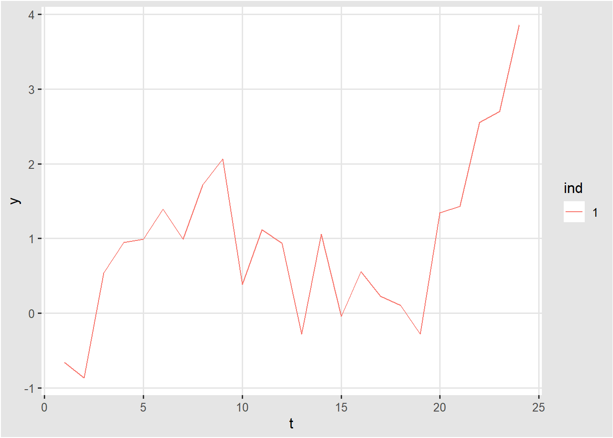

# 시계열 모델의 기초 {#ch2}

## 시계열 예측 단계  (fpp3 1.6)

시계열 예측은 아래의 5개의 단계를 포함한다.

### 1단계. 문제 정의

예측 분석에서 가장 어려운 부분은 바로 문제를 정의하는 것이다. 예측 문제를 정의할 때, 1. 이 예측 모델이 어떻게 사용될지, 2. 예측 모델을 누가 요구하는지, 3. 예측 결과가 어떻게 사용자의 요구와 부합하는지에 대한 이해를 필요로 한다. 예측 분석자들은 자료를 수집하고, 데이터베이스를 관리하며, 미래 계획을 수립하는 사람들과 많은 이야기를 나누어야 한다.

### 2단계. 정보 수집

수집하는 정보는 통계 데이터 뿐만 아니라 데이터를 모으고 예측을 하려는 분야의 축적된 전문성을 포함한다. 종종, 좋은 통계 모델을 수립하기 위한 충분한 양의 과거의 데이터를 모으기는 어렵다. 이럴 경우에 판단예측법 (Judgmental forecasting)이 사용된다. (fpp3 Chapter 6). 오래된 데이터는 예측하려는 시스템의 구조가 변할 경우에 덜 유용한 경우가 많다. 이럴 때에는 가장 최근의 데이터만을 사용하기도 한다. 하지만, 좋은 통계 모델은 시스템 구조의 변화를 반영할 수 있어야 한다. 불필요하게 데이터를 버리지 마십시오.

### 3단계. 기초 분석

항상 데이터의 그래프를 그리는 것으로 시작하라. 일관된 패턴이 있는가? 유의한 트렌드가 있는가? 계절성이 중요한가? 주기성이 존재한다는 증거가 있는가? 전문적 지식으로 설명해야 하는 아웃라이어가 있는가? 변수 사이의 강한 상관관계가 있는가?

### 4단계. 모델 선택 및 피팅

최고의 모델은 과거 자료의 사용유무, 예측 변수들 사이의 관계의 정도, 예측이 사용되는 방식에 따라 정해진다. 2 ~ 3 개의 모델을 비교하는 것이 일반적이다. 각각의 모델은 여러 가정 위에 올려진 인위적인 산물로써, 모델 내의 파라미터들은 데이터 샘플을 통해서 추정된다. `fpp3` 책에서는 다루는 모델은 아래와 같다.

1. Regression Model
2. Exponential Smoothing Methods
3. Box-Jenkins ARIMA models
4. Dynamic regression model
5. Hierarchical forecasting
6. Neural networks and vector autoregression

### 5단계. 모델 사용과 평가

일단 모델을 선택하고 파라미터를 추정한 뒤에, 모델은 예측을 수행할 수 있다. 모델의 성능은 예측 기간의 데이터가 가능해진 뒤에 평가가 가능하다. 예측의 정확도를 평가하기 위한 많은 방법이 개발되어 왔다. 예측 모델을 실용적으로 사용하는 데 중요한 이슈들로써, Missing Value 및 Outlier 처리, 혹은 짧은 시계열을 어떻게 다루는가 등이 있다.   

## 시계열 데이터 분포

먼저 `fpp3` 패키지에 있는 예제를 살펴보기로 하자. `fpp3` 패키지를 불러오면 `tsibble`, `feasts`, 와 `fable` 패키지 내의 함수를 또한 사용할 수 있다.


```r
library(fpp3)
library(dplyr)
library(ggplot2)
```

호주 빅토리아 주의 전력 수요량을 30분 단위로 기록한 `vic_elec` 데이터의 2012년도 일일별 전력량을 표현한 그래프는 아래와 같다. 


```r
vic_elec %>% 
  janitor::clean_names() %>% 
  filter(year(time) == 2012) %>% 
  gg_season(demand, period = "day") +
  theme(legend.position = "none") +
  labs(y="MWh", title="Electricity demand: Victoria")
```


위의 그래프를 볼 때에 우리는 0시에서부터 23시 30분까지 총 48개씩의 데이터 포인트를 갖는 365개의 데이터 샘플로 볼 수 있다. 

## 시계열 모델 분석을 위한 기초

### 확률과정 (Stochastic Process) 

$\{Y_t: t = 0, \pm 1 , \pm 2, \pm 3, \dots \}$ 

확률 과정은 랜덤 변수의 시퀀스로써, 관측된 시계열 데이터 분석을 위한 모델로써 사용된다.
위 확률 과정의 분석은 평균, 분산, 공분산에서 얻은 정보를 바탕으로 이루어진다.

### 평균함수 (Mean Function)

평균함수는 아래와 같이 정의된다. 

$\mu_t = \rm{E} [\it Y_t \rm ] \quad for \quad  t = 0, \pm1, \pm2, \dots$

여기에서 $\mu_t$는 $t$의 함수이며, 일반적으로 time point $t$에 따라서 변할 수 있다. 

### 자기공분산 함수 (Autocovariance function)

자기공분산 함수는 아래와 같이 정의된다. 

$\gamma_{t, s} = \rm{Cov} (\it Y_t, Y_s \rm ) \quad for \quad  t, s = 0, \pm1, \pm2, \dots$

$\rm{Cov} (\it Y_t, Y_s \rm ) = \rm{E} [(Y_t - \mu_t)(Y_t - \mu_s) \rm ]$


### 자기상관함수 (Autocorrelation function)

자기상관함수는 아래와 같이 정의된다.

$\rho_{t, s} = \rm{Corr} (\it Y_t, Y_s \rm ) \quad for \quad  t, s = 0, \pm1, \pm2, \dots$

$\rm{Corr} (\it Y_t, Y_s \rm ) = \cfrac{Cov(\it Y_t, Y_s \rm )}{\sqrt{Var(Y_t)}\sqrt{Var(Y_s)}}$

자기상관함수의 성질

## 예제 1. 백색소음 모형 (White Noise)

백색소음 모형이란?

$\{e_t = e_1, e_2, \dots \}$ 는 서로 독립적이고 동일한 분포를 갖는 랜덤 변수들로써, 평균은 0이고, 분산은 $\sigma_e^2$으로 가정한다. 우리는 이를 백색소음 (White Noise)라고 부른다. 

$\{Y_t = e_t: t = 1 , 2, 3, \dots \} \\ \mu_t = E[Y_t] = E[e_t] = 0 \\ Var(Y_t) = Var(e_t) = \sigma_e^2 \\ Cov(Y_t, Y_s) = Cov(e_t, e_s) = 0 \quad \rm{for} \quad t \neq s \\ Corr(Y_t, Y_s) = Corr(e_t, e_s) = 0 \quad \rm{for} \quad t \neq s$ 

서로 독립적인 랜덤 변수들이기 때문에, 공분산은 0이 된다.

백색소음 모형 데이터의 분포


```r
white.noise <- tsibble(t = seq_len(24), y = rnorm(24), index = t)
white.noise %>% autoplot()
```


```r
N <- 100
df.wn <- data.frame(ind = integer(), t = integer(), y = double())
for (i in seq(N)){
  white.noise <- tsibble(t = seq_len(24), y = rnorm(24), index = t)
  white.noise <- white.noise %>% 
    mutate(ind = i) %>% 
    select(ind, t, y) %>% 
    as.data.frame()
  df.wn <- df.wn %>% bind_rows(white.noise)
}

df.wn$ind <- df.wn$ind %>% as.factor()

# One sample
ggplot(df.wn %>% filter(ind == "1"), aes(x = t, y = y, col = ind)) + geom_line()
```


```r
# Distribution
ggplot(df.wn, aes(x = t, y = y, col = ind)) + 
  geom_line() + 
  theme(legend.position="none")
```


## 예제 2. 랜덤워크 모형 (Random Walk)

랜덤워크 모형은 아래와 같이 정의된다. $t$번째 값은 $t-1$번째 값에서 백색소음 값을 더한 것으로 정의된다. 

$\{Y_1 = e_1, \quad Y_t = Y_{t-1} + e_t: t = 2, 3, \dots \}  \\ \mu_t = E[Y_t] = E[Y_{t-1}] + E[e_t] = \mu_{t-1} + 0 = \mu_{t-1} = \cdots = \mu_1 = 0 \\ Var(Y_t) = Var(Y_{t-1}) + Var(e_t) = Var(Y_{t-1}) + \sigma_e^2 = \cdots = t  \sigma_e^2 \\ Cov(Y_t, Y_s) = Cov(Y_s + e_{s+1} + \cdots + e_t, Y_s) = Cov(Y_s, Y_s) = Var(Y_s) = s \sigma_e^2 \quad \rm{for} \quad t > s \\ Corr( Y_t, Y_s) = \cfrac{Cov(\it Y_t, Y_s \rm )}{\sqrt{Var(Y_t)}\sqrt{Var(Y_s)}}  = \cfrac{s\sigma_e^2}{\sqrt{t \sigma_e^2}\sqrt{s \sigma_e^2}} = \sqrt{\cfrac{s}{t}}  \quad \rm{for} \quad t > s$

위에서 우리는 랜덤 워크 모형의 평균은 0이고, 분산은 $t$에 따라 증가하는 패턴을 보임을 알 수 있다.


```r
N <- 100
df.rw <- data.frame(ind = integer(), t = integer(), y = double())
for (i in seq(N)){
  random.walk <- tsibble(t = seq_len(24), y = cumsum(rnorm(24)), index = t)
  random.walk <- random.walk %>% 
    mutate(ind = i) %>% 
    select(ind, t, y) %>% 
    as.data.frame()
  df.rw <- df.rw %>% bind_rows(random.walk)
}

df.rw$ind <- df.rw$ind %>% as.factor()

# One sample
ggplot(df.rw %>% filter(ind == "1"), aes(x = t, y = y, col = ind)) + geom_line()
```



```r
# Distribution
ggplot(df.rw, aes(x = t, y = y, col = ind)) + 
  geom_line() + 
  theme(legend.position="none")
```


## 예제 3. 이동평균 모형 (Moving Average)

이동평균 모형은 아래와 같이 정의된다. 

$\{Y_t = \frac{1}{2} (e_t + e_{t-1}): t = 2, 3, \dots \} \\ \mu_t = E[Y_t] = \frac{1}{2} (E[e_t] + E[e_{t-1}] = 0 \\ Var(Y_t) = \frac{1}{4} Var(e_t) + \frac{1}{4} Var(e_{t-1}) = \frac{1}{4} \sigma_e^2 + \frac{1}{4} \sigma_e^2 = \frac{1}{2} \sigma_e^2 \\ Cov(Y_t, Y_{t-1}) = Cov(\frac{1}{2} (e_t + e_{t-1}), \frac{1}{2} (e_{t-1} + e_{t-2})) = \cfrac{1}{4}\sigma_e^2 \\ Cov(Y_t, Y_s) = Cov(\frac{1}{2} (e_t + e_{t-1}), \frac{1}{2} (e_{s} + e_{s-1})) = 0 \quad \rm for \quad |t-s| > 1 \\ Corr(Y_t, Y_t) = 1 \\ Corr(Y_t, Y_{t-1}) = 0.5  \\ Corr(Y_t, Y_s) = 0 \quad for \quad |t-s|>1$


```r
library(zoo)
white.noise <- tsibble(t = seq_len(100), y = rnorm(100), index = t)

# moving average with rollmean
white.noise.r <- white.noise %>%
  mutate(yavg = rollmean(y, k = 5, align = "right", fill = NA ))

white.noise.r
```

```
#> # A tsibble: 100 x 3 [1]
#>        t      y    yavg
#>    <int>  <dbl>   <dbl>
#>  1     1  0.534 NA     
#>  2     2 -0.362 NA     
#>  3     3 -2.00  NA     
#>  4     4  1.20  NA     
#>  5     5  0.988  0.0712
#>  6     6 -0.425 -0.121 
#>  7     7 -0.917 -0.232 
#>  8     8  1.11   0.391 
#>  9     9  0.835  0.318 
#> 10    10 -0.943 -0.0678
#> # ... with 90 more rows
```

```r
# Mean
white.noise <- white.noise %>%
  mutate(y1 = lag(y, n = 1)) %>%
  rowwise() %>%
  mutate(avg = mean(c_across(y:y1), na.rm=TRUE))

white.noise.r %>%
  ACF(yavg, lag_max = 17) %>%
  autoplot()
```


## 정상성 (Stationarity)

시계열 모델이 아래와 같은 조건을 만족할 때 이 모델은 정상성을 띤다고 한다. 

+ $\mu_t$ 가 상수이며, 시점 $t$와 무관하다.
+ 자기공분산함수 $\gamma_{s,t}$는 $|s-t|$에만 의존한다. 즉, 시점 $t$와 무관하다. 

위의 예제에서 백색소음 모형은 정상성을 띤다고 할 수 있다.


```r
# Distribution
ggplot(df.wn, aes(x = t, y = y, col = ind)) + geom_line() + 
  theme(legend.position="none")
```


위의 예제에서 랜덤워크 모형은 정상성을 띤다고 할 수 없다. 그 이유는 분산이 시간 $t$가 증가함에 따라 증가하는 패턴을 보이기 때문이다.


```r
# Distribution
ggplot(df.rw, aes(x = t, y = y, col = ind)) + geom_line() + 
  theme(legend.position="none")
```


