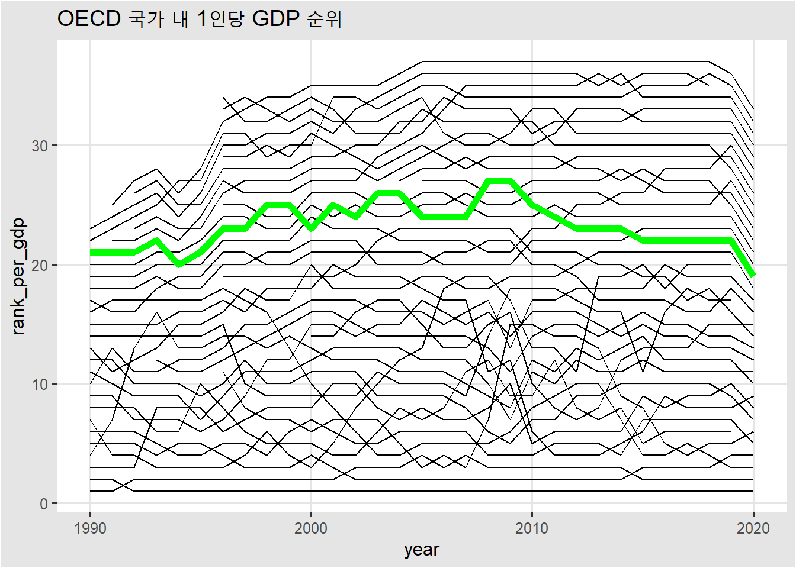
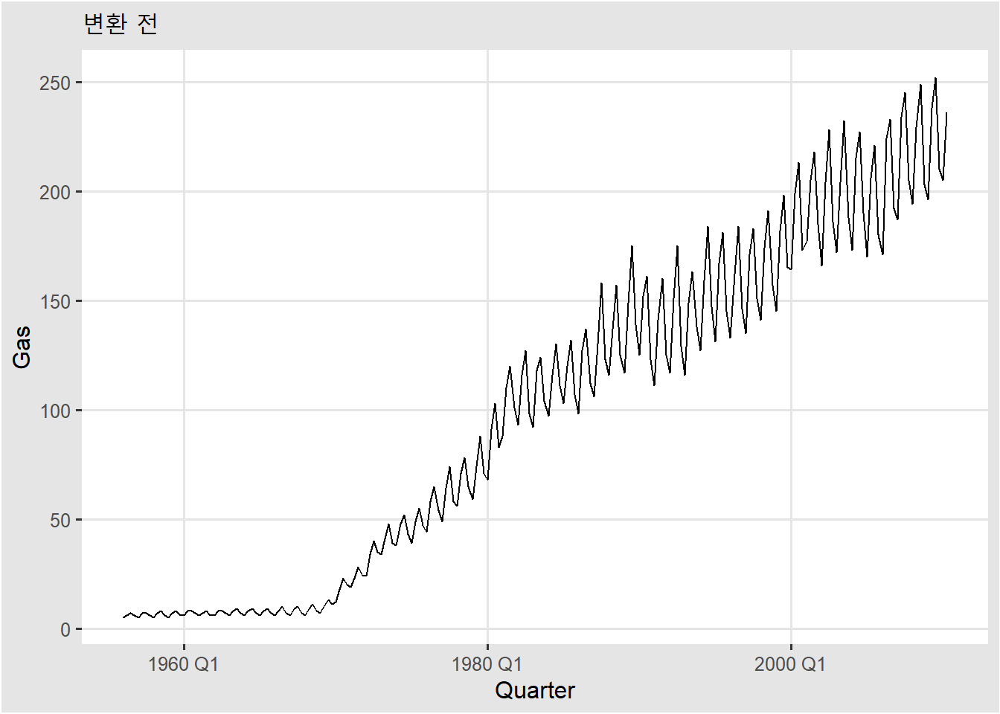
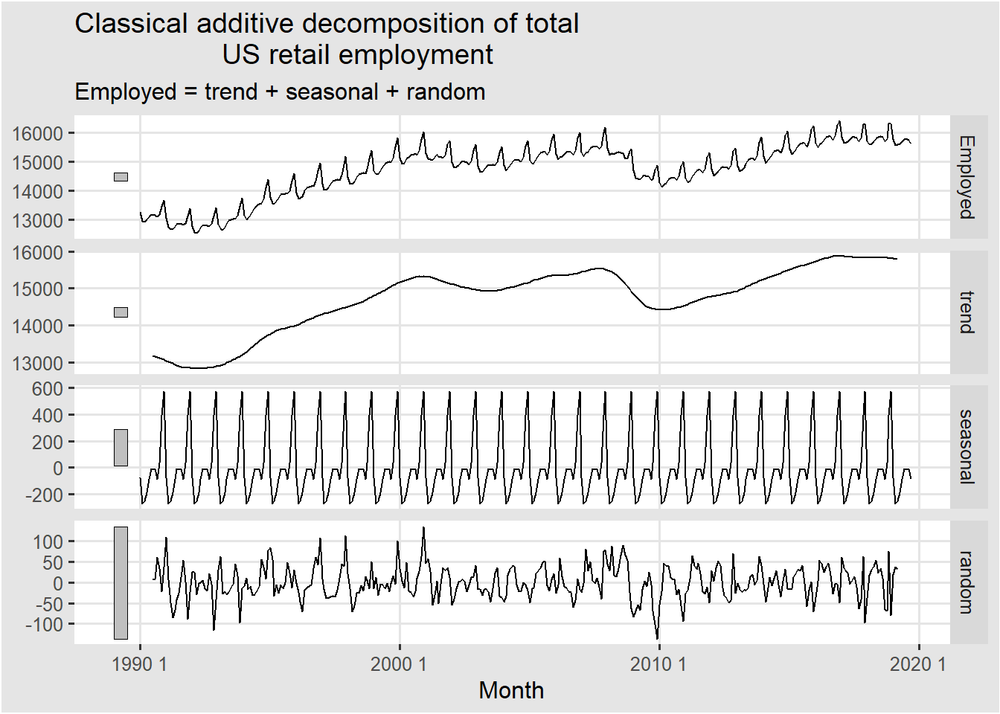
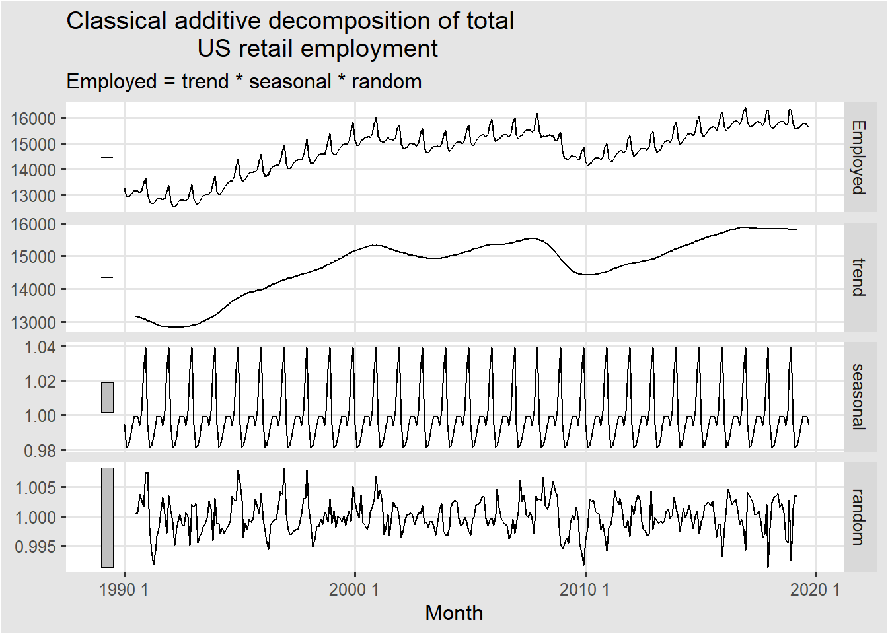
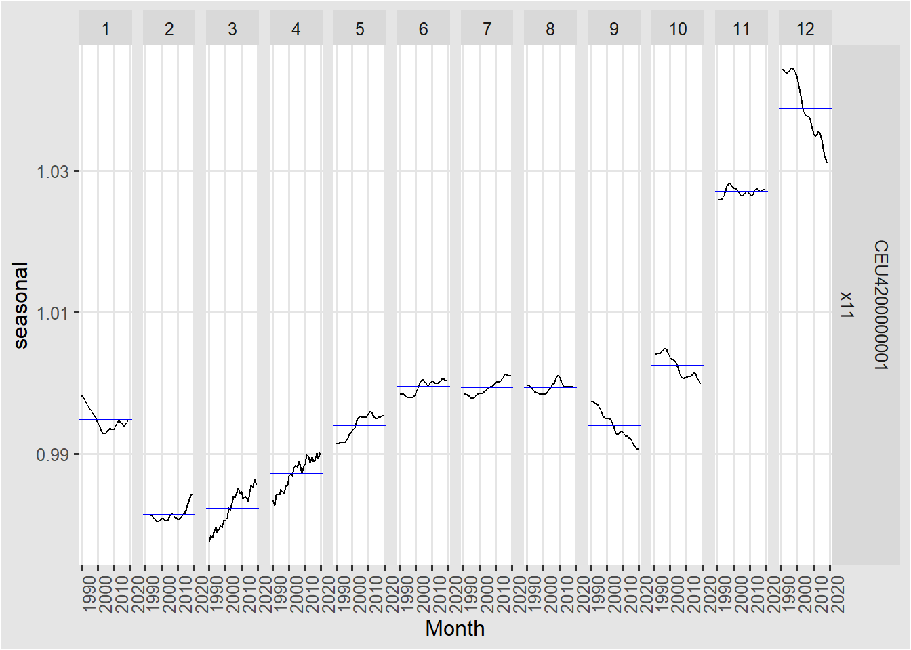

# 시계열의 분해 {#chap3}

이 장의 학습목표는,
**고전적인 시계열 분해방법**이 어떻게 계산되는지 이해하는 것이다.
이는 최근에 사용되고 있는 다른 방법들의 근간이 되므로 제대로 이해할 필요가 있다.


## 시계열 조정 및 변환

 분석하고자 하는 문제에 따라서, 조정이 필요한 경우가 있다. 이런 과정은 왜곡되지 않은 시계열 정보를 추출 하기 위한 것이라고 생각하면 된다. 

### 인구조정

우리가 분석하고 싶은 것이 나라별 성장 추이라고 해보자. 
어떤 변수를 선택하면 좋을까? 경제 성장률 추이, 나라별 GDP 총 생산 등이 있을 것이고, 1인당 GDP 등이 있다.
이때 GDP 를 기준으로 보느냐, 1인당 GDP를 기준으로 보느냐에 따라서도 순위 차이가 꽤 있음을 확인 할 수 있다.


```r
# KOSIS OECD_국가의_주요지표 자료 다운로드 
# https://kosis.kr/statHtml/statHtml.do?orgId=101&tblId=DT_2KAAG01
gdp_national<- gdp_national %>% 
  select(year , everything()) %>% 
  select(year:CPI) %>% 
  #mutate(year = year ) %>% 
  as_tsibble(key = nation:CPI,
             index = year) %>% 
  mutate(nation = as.factor(nation)) %>% 
  mutate_if(is.character, as.numeric) %>% 
  drop_na() %>% 
  group_by(nation) %>%
  arrange(year) %>% 
  ungroup()

gdp_national %>% head(10)
```

```
#> # A tsibble: 10 x 10 [1Y]
#> # Key:       nation, total_GDP, per_GDP, GDP_growth, export, import, pop,
#> #   unemployment_rate, CPI [10]
#>     year nation     total_GDP per_GDP GDP_growth export import    pop
#>    <int> <fct>          <dbl>   <dbl>      <dbl>  <dbl>  <dbl>  <int>
#>  1  1990 그리스          97.9    9600        0     8105  19777  10226
#>  2  1990 네덜란드       318.    21291        4.2 131775 126098  14965
#>  3  1990 노르웨이       120.    28243        1.9  34047  27231   4247
#>  4  1990 뉴질랜드        45.5   13663        0.2   9488   9501   3398
#>  5  1990 덴마크         138.    26891        1.5  37037  33248   5141
#>  6  1990 독일          1772.    22304        5.3 410104 346153  79054
#>  7  1990 룩셈부르크      13.2   34645        5.3   6305   7596    382
#>  8  1990 미국          5963.    23889        1.9 393592 516987 252120
#>  9  1990 스웨덴         262.    30594        0.8  57507  54835   8567
#> 10  1990 스위스         266     39608        3.7  63784  69681   6653
#> # ... with 2 more variables: unemployment_rate <dbl>, CPI <dbl>
```

```r
rank_gdp<- gdp_national %>% 
  index_by(year) %>%
  mutate(rank_total_gdp = rank(-total_GDP),
            rank_per_gdp = rank(-per_GDP)
            ) %>% 
  ungroup() %>% 
  select(year,nation,contains("rank"))


rank_gdp %>% 
  ggplot(aes(x = year, y =rank_total_gdp , fill = nation ))+
  geom_line()+
  geom_line(data = rank_gdp %>% filter(nation =="한국"),color = "green",size =2)+
  labs(title = "OECD 국가 내 GDP 순위")
```


```r
rank_gdp %>% 
  ggplot(aes(x = year, y =rank_per_gdp , fill = nation ))+
  geom_line()+
  geom_line(data = rank_gdp %>% filter(nation =="한국"),color = "green",size =2)+
  labs(title = "OECD 국가 내 1인당 GDP 순위")
```



```r
rank_gdp %>% 
  filter(year<=2019) %>% 
  filter(nation == "한국") %>% 
  pivot_longer(cols = contains("rank")) %>% 
  ggplot(aes(x = year, y =value , color = name ))+
  geom_line()+
  labs(y ="Rank")
```


```r
# 데이터가 OECD 가입국이라 우리나라보다 GDP가 높은 중국, 인도 등 없는 나라가 있습니다.
```
1990년에서 부터 2019년 까지의 결과를 봤을때 OECD회원국 중, GDP의 순위는 높아졌지만,
1인당 GDP의 순위는 낮아진 것을 확인 할 수 있다.

인구 조정에 따라 결과가 달라지는 것을 확인했다. 이 경우에는 물론 분석 과제에 따라
인구 조정을 하지 않은 총 GDP를 사용 할 수도 있을 것이다.


다른 예시로, 나라별 의료체계 수준을 비교하려면, 총 병원수를 그 나라의 인구로 나눠 
평균적인 밀도를 비교하는 것이 더 합리적일 수 있다. 

### 물가조정

위의 데이터를 통해 더 확인해 보자. 변수 중, CPI(Consumer Price Index)라는 것이 있는데,
이는 기준년도를 100으로 뒀을때 그 해의 소비자 물가지수이다. 이를 통해 수십년 전의 물건 가격들을 현재 물가 기준으로 하여 계산할 수 있고 무역수지가 물가에 비해 얼마나 올랐는지 확인 할 수 있다. 
만약 2010년이 기준년도이고, 2011년 CPI가 103이라면, 2010년에 비해 소비자 물가가 3% 증가한 것이다. 국가별 무역수지 추이를 CPI로 조정해 보면 아래와 같다.

```r
gdp_national %>% 
  mutate(
    trade_net_income = (export - import) ,
    adjusted_trade_net_income = trade_net_income / CPI*100
  ) %>%
  filter(nation=="한국") %>%
  pivot_longer(cols = contains("net")) %>% 
  ggplot(aes(x= year, y= value ,color = name))+
  geom_line()
```


### 달력조정

어떤 기업에서 월별 매출을 비교해 보려고 한다. 이때 단순히 총 매출을 비교한다면, 2월은 다른달에 비해
낮게 나올 수도 있으므로 일별평균매출을 비교하는것이 더 합리적일 수 있다.  
(주말, 공휴일이 많은달? 시차 조정? 등등 )

### 수학적 변환

데이터가 시간에 따라 분산이 커지거나 작아질 때 사용한다.


```r
aus_production %>% 
  ggplot(aes(x = Quarter, y = Gas))+
  geom_line()+
  labs(
    title = "변환 전"
  )
```



```r
lambda <- aus_production %>%
  features(Gas, features = guerrero) %>%
  pull(lambda_guerrero)

aus_production %>%
  mutate(boxcox = box_cox(Gas, lambda))
```

```
#> # A tsibble: 218 x 8 [1Q]
#>    Quarter  Beer Tobacco Bricks Cement Electricity   Gas boxcox
#>      <qtr> <dbl>   <dbl>  <dbl>  <dbl>       <dbl> <dbl>  <dbl>
#>  1 1956 Q1   284    5225    189    465        3923     5   1.78
#>  2 1956 Q2   213    5178    204    532        4436     6   2.00
#>  3 1956 Q3   227    5297    208    561        4806     7   2.19
#>  4 1956 Q4   308    5681    197    570        4418     6   2.00
#>  5 1957 Q1   262    5577    187    529        4339     5   1.78
#>  6 1957 Q2   228    5651    214    604        4811     7   2.19
#>  7 1957 Q3   236    5317    227    603        5259     7   2.19
#>  8 1957 Q4   320    6152    222    582        4735     6   2.00
#>  9 1958 Q1   272    5758    199    554        4608     5   1.78
#> 10 1958 Q2   233    5641    229    620        5196     7   2.19
#> # ... with 208 more rows
```

```r
aus_production %>%
  autoplot(box_cox(Gas, lambda)) +
  labs(y = "",
       title = latex2exp::TeX(paste0(
         "Transformed gas production with $\\lambda$ = ",
         round(lambda,2))))
```


사전에 이런 조정 없이 분해를 하게 되면 실제 데이터가 함축하고 있는 의미를 제대로 잡아내지 못할 수 
있고 예측 오차가 커지게 될 것이다. 따라서 다음 단계로 가기 전에 내가 분석하고 싶은 변수가 조정이 
필요한지 짚고 넘어갈 필요가 있다. 

## 시계열의 구성요소 


각각의 관측치 $y_{t}$ 는 $S_{t}$ , $T_{t}$, $R_{t}$  의 구성요소로 나누어 볼 수 있다.

* $T_{t}$ : 추세-주기(Trend-cycle) 구성요소

* $S_{t}$ : 계절(Seasonal) 구성요소  

* $R_{t}$ : 관측치 $y_{t}$에서 위 두가지 요소를 뺀 나머지 부분이다.


### 모델 설정


\[
y_{t}=S_{t}+T_{t}+R_{t}
\]
\[
y_{t}=S_{t}\times T_{t}\times R_{t}
\]

위와 같이 관측치를 구성요소들의 합으로 분해할 것인지, 곱으로 분해할 것인지 2가지 방법을 고려할 수 있다. 

계절 변동의 크기 또는 추세 주기 변동이 시간에 따라 달라지지 않는 경우 가법 분해가 가장 적절하다. 계절 패턴의 변동 또는 추세 주기 변동이 시간이 흐르면서 변하는 것으로 나타나면 곱셈 분해가 더 적절하다. 

먼저, 각각의 요소가 어떻게 분해되는지 살펴보자


```r
us_retail_employment <- us_employment %>%
  filter(year(Month) >= 1990, Title == "Retail Trade")

classical_decomp<- us_retail_employment %>%
  model(
    classical_decomposition(Employed , type = "additive") #Employed ~ season(7)
  ) %>%
  components() %>% as_tsibble()

classical_decomp
```

```
#> # A tsibble: 357 x 8 [1M]
#> # Key:       Series_ID, .model [1]
#>    Series_ID     .model      Month Employed  trend seasonal random season_adjust
#>    <chr>         <chr>       <mth>    <dbl>  <dbl>    <dbl>  <dbl>         <dbl>
#>  1 CEU4200000001 "classic~  1990 1   13256.    NA    -75.5   NA           13331.
#>  2 CEU4200000001 "classic~  1990 2   12966.    NA   -273.    NA           13239.
#>  3 CEU4200000001 "classic~  1990 3   12938.    NA   -253.    NA           13191.
#>  4 CEU4200000001 "classic~  1990 4   13012.    NA   -190.    NA           13203.
#>  5 CEU4200000001 "classic~  1990 5   13108.    NA    -88.9   NA           13197.
#>  6 CEU4200000001 "classic~  1990 6   13183.    NA    -10.4   NA           13193.
#>  7 CEU4200000001 "classic~  1990 7   13170. 13178.   -13.3    5.65        13183.
#>  8 CEU4200000001 "classic~  1990 8   13160. 13161.    -9.99   8.80        13169.
#>  9 CEU4200000001 "classic~  1990 9   13113. 13141.   -87.4   59.9         13201.
#> 10 CEU4200000001 "classic~ 1990 10   13185. 13117.    34.6   33.8         13151.
#> # ... with 347 more rows
```

```r
us_retail_employment %>%
  model(
    classical_decomposition(Employed, type = "additive")
  ) %>%
  components() %>%
  autoplot() +
  labs(title = "Classical additive decomposition of total
                  US retail employment")
```


## 이동평균에 대한 이해

앞서 봤던 고전적 분해방법의 단계중 첫단계가 이동평균으로 추세-주기 구성요소를 계산하는 것이기 때문에
이동평균에 대한 이해가 필요하다. 
다음과 같이 정의 된다.

\[
\hat{T}_{t}=\frac{1}{m}\sum_{j=-k}^{k}y_{t+j}
\]


이동평균을 하게 되면 무작위성을 어느정도 제거하여 원래의 데이터보다 완만한 곡선을 그리게 된다.

### m이 홀수인 경우


```r
global_economy %>%
  filter(Country == "Australia") %>%
  autoplot(Exports) +
  labs(y = "% of GDP", title = "Total Australian exports")
```


```r
library(zoo)
aus_exports <- global_economy %>%
  filter(Country == "Australia") %>%
  mutate(
    `3-MA` =rollmean(Exports,fill = NA,k = 3),
    `5-MA` =rollmean(Exports,fill = NA,k = 5),
    `7-MA` =rollmean(Exports,fill = NA,k = 7),
    `9-MA` =rollmean(Exports,fill = NA,k = 9)
         ) %>% 
  pivot_longer(cols = contains("MA"))


aus_exports %>%
  ggplot(aes(x=Year , y = Exports)) +
  #geom_line()+
  geom_line(aes(y = value), colour = "#D55E00") +
  labs(y = "% of GDP",
       title = "Total Australian exports") +
  facet_wrap(~ name,ncol = 2)
```


<table class="kable_wrapper">
<caption>(\#tab:unnamed-chunk-7)처음과 마지막 행 5개</caption>
<tbody>
  <tr>
   <td> 

| Year|  Exports|     5-MA|
|----:|--------:|--------:|
| 1960| 12.99445|       NA|
| 1961| 12.40310|       NA|
| 1962| 13.94301| 13.45694|
| 1963| 13.00589| 13.50208|
| 1964| 14.93825| 13.60794|

 </td>
   <td> 

| Year|  Exports|     5-MA|
|----:|--------:|--------:|
| 2013| 19.98772| 20.81365|
| 2014| 21.07577| 20.36969|
| 2015| 20.01296| 20.31997|
| 2016| 19.25303|       NA|
| 2017| 21.27035|       NA|

 </td>
  </tr>
</tbody>
</table>


### m이 짝수인 경우


```r
beer <- aus_production %>%
  filter(year(Quarter) >= 1992) %>%
  select(Quarter, Beer)
beer_ma <- beer %>%
  mutate(
    `4-MA` = slider::slide_dbl(Beer, mean,
                .before = 1, .after = 2, .complete = TRUE),
    `2x4-MA` = slider::slide_dbl(`4-MA`, mean,
                .before = 1, .after = 0, .complete = TRUE)
  )
  # mutate(`4-MA` =rollmean(Beer,fill = NA,k = 4)) %>% 
  # mutate(`2x4-MA` =rollmean(`4-MA`,fill = NA,k = 2,align = "right")) 
```


<table class="kable_wrapper">
<caption>(\#tab:unnamed-chunk-9)처음과 마지막 행 5개</caption>
<tbody>
  <tr>
   <td> 

|Quarter | Beer|   4-MA|  2x4-MA|
|:-------|----:|------:|-------:|
|1992 Q1 |  443|     NA|      NA|
|1992 Q2 |  410| 451.25|      NA|
|1992 Q3 |  420| 448.75| 450.000|
|1992 Q4 |  532| 451.50| 450.125|
|1993 Q1 |  433| 449.00| 450.250|

 </td>
   <td> 

|Quarter | Beer|   4-MA|  2x4-MA|
|:-------|----:|------:|-------:|
|2009 Q2 |  398| 430.00| 430.000|
|2009 Q3 |  419| 429.75| 429.875|
|2009 Q4 |  488| 423.75| 426.750|
|2010 Q1 |  414|     NA|      NA|
|2010 Q2 |  374|     NA|      NA|

 </td>
  </tr>
</tbody>
</table>

${\hat{T_{t}}=\frac{1}{2}\Big[\frac{1}{4}(y_{t-2}+y_{t-1}+y_{t}+y_{t+1})+\frac{1}{4}(y_{t-1}+y_{t}+y_{t+1}+y_{t+2})\Big]=\frac{1}{8}y_{t-2}+\frac{1}{4}y_{t-1}+\frac{1}{4}y_{t}+\frac{1}{4}y_{t+1}+\frac{1}{8}y_{t+2}.}$

### 가중평균

$\hat{T}_{t}=\sum_{j=-k}^{k}a_{j}y_{t+j},$

이때 모든 $a_{j}$의 합이 1이고, $a_{j}=a_{-j}$을 만족해야 한다.

예를들어, 단순한 5-MA 말고, $y_{t}$ 를 기준으로 멀어질 수록 가중치를 멀어지게 하려면,
$3\times3$-MA 를 사용하면 가중치는 $a=[\frac{1}{9},\frac{2}{9},\frac{3}{9},\frac{2}{9},\frac{1}{9}]$ 이 된다. 이렇게 가중치를 조절함으로써 추세의 완만한 정도를 조절할 수 있다.


## 다양한 분해방법

### 고전적 분해방법

고전적 분해 방법은 다른 시계열 분해방법의 시작점인만큼 계산이 간단하다.

고전적 분해에서는 계절 성분이 매년 일정하다고 가정한다.

tsibble 데이터의 한 주기가 어느정도 되는지에 따라 m-MA의 m을 설정한다.
예를 들어, 월별 데이터 인데 분기별 추세를 보고자 한다면, m = 4 가 될 것이고, 월별 추세를 보려면 m = 12, 일별데이터인데 주별 패턴을 확인하고 싶다면 m = 7 이 될 것이다.


#### 가산분해

* 1단계, 추세-주기 요소를 계산한다.m이 짝수이면, 2 X m-MA 로 계산하고
홀수이면, m-MA로 계산한다.

* 2단계, $y_{t}$에서 추세-주기를 뺀다.

* 3단계, 추세-주기를 뺀 데이터를 각각의 계절 요소의 그룹별로 평균을 구한다. 
예를 들어, m이 12인, 월별 계절 요소를 계산한다고 생각하자. 데이터에서 2 x 12 MA 로 계산한 추세-주기 요소를
원래 있던 시계열 정보에서 뺀 후, 그 데이터를 월별로 그룹을 지어 평균을 계산하면 된다.


* 4단계, 3단계의 결과값에서 계산된 값들의 평균을 구하여 각각의 결과값에 빼준다.
이렇게 계산된 값이 계절 요소이다. 즉, 계절요소의 평균은 0이 된다.

* 5단계, 원래의 시계열 정보에서 계산된 추세-주기,계절 요소를 빼면 나머지 요소가 계산된다.


```r
classical_decomp<- us_retail_employment %>%
  model(
    classical_decomposition(Employed, type = "additive")
  ) %>%
  components() %>% as_tsibble()

calculate_seasonal <- classical_decomp %>% 
  select(Month,Employed,trend,seasonal) %>% 
  mutate(seasonal_step_2 = Employed - trend) %>% 
  index_by(month(Month)) %>%
  mutate(seasonal_step_3 = mean(seasonal_step_2,na.rm =T)) %>% 
  ungroup() %>% view

seasonal_step_4 <- calculate_seasonal %>% 
  pull(seasonal_step_3) %>% unique() %>% mean()

# unique를 해주는 이유는 이 데이터와 같이 주기가 딱 떨어지지 않을 수 있기 때문이다.
# 1~12월*29번, + 1~9월 이있음.
seasonal_step_4
```

```
#> [1] -0.01894243
```


Table: (\#tab:unnamed-chunk-11)가법모형 seasonal 계산결과

|    seasonal| seasonal_step_2| seasonal_step_3| seasonal_step_5|Month   |
|-----------:|---------------:|---------------:|---------------:|:-------|
|  -75.461230|              NA|       -75.48017|      -75.461230|1990 1  |
| -273.051173|              NA|      -273.07011|     -273.051173|1990 2  |
| -253.195856|              NA|      -253.21480|     -253.195856|1990 3  |
| -190.219599|              NA|      -190.23854|     -190.219599|1990 4  |
|  -88.923022|              NA|       -88.94196|      -88.923022|1990 5  |
|  -10.388349|              NA|       -10.40729|      -10.388349|1990 6  |
|  -13.311661|       -7.662500|       -13.33060|      -13.311661|1990 7  |
|   -9.992695|       -1.195833|       -10.01164|       -9.992695|1990 8  |
|  -87.379333|      -27.470833|       -87.39828|      -87.379333|1990 9  |
|   34.634747|       68.454167|        34.61580|       34.634747|1990 10 |
|  394.300408|      372.362500|       394.28147|      394.300408|1990 11 |
|  572.987764|      610.708333|       572.96882|      572.987764|1990 12 |


```r
us_retail_employment %>%
  model(
    classical_decomposition(Employed, type = "additive")
  ) %>%
  components() %>%
  autoplot() +
  labs(title = "Classical additive decomposition of total
                  US retail employment")
```



```r
classical_decomp%>%
  gg_subseries(seasonal)
```


#### 승법분해

* 1단계, 추세-주기 요소를 계산한다.m이 짝수이면, 2 X m-MA 로 계산하고
홀수이면, m-MA로 계산한다.

* 2단계, $y_{t}$에서 추세-주기를 나눈다.

* 3단계, 2단계에서 계산된 값들에 
계절 요소의 그룹별로 평균을 구한다. 예를 들어, m이 12인, 월별 계절 요소를 
계산한다고 생각하자. 데이터에서 2 x 12 MA 를 계산한 추세-주기 요소를
원래 있던 시계열 정보에서 나눈 후, 그 데이터를 월별로 그룹을 지어 평균을 계산하면 된다.

* 4단계, 3단계의 계산 결과나온 요소들의 합이 m이 되도록 크기 조정을 해준다.
이 값이 계절 요소가 된다.

* 5단계, 원래의 시계열 정보에서 계산된 추세-주기,계절 요소를 나누면 나머지 요소가 계산된다.


```r
classical_decomp<- us_retail_employment %>%
  model(
    classical_decomposition(Employed, type = "multiplicative")
  ) %>%
  components() %>% as_tsibble()

seasonal_mult <-  classical_decomp %>% 
  select(Month,Employed,trend,seasonal) %>% 
  mutate(seasonal_step_2 = Employed / trend) %>% 
  index_by(month(Month)) %>%
  mutate(seasonal_step_3 = mean(seasonal_step_2,na.rm =T)) %>% 
  select(contains("seasonal"))

seasonal_step_3_scale<- sum(unique(seasonal_mult$seasonal_step_3))
seasonal_step_3_scale
```

```
#> [1] 11.99982
```

```r
seasonal_mult <- seasonal_mult %>% 
  mutate(seasonal_step_4 = seasonal_step_3/seasonal_step_3_scale*12)
```


Table: (\#tab:unnamed-chunk-14)승법모형 seasonal 계산결과

| month(Month)|  seasonal| seasonal_step_2| seasonal_step_3|Month   | seasonal_step_4|
|------------:|---------:|---------------:|---------------:|:-------|---------------:|
|            1| 0.9949463|              NA|       0.9949310|1990 1  |       0.9949463|
|            2| 0.9814765|              NA|       0.9814614|1990 2  |       0.9814765|
|            3| 0.9827143|              NA|       0.9826991|1990 3  |       0.9827143|
|            4| 0.9869857|              NA|       0.9869705|1990 4  |       0.9869857|
|            5| 0.9938970|              NA|       0.9938817|1990 5  |       0.9938970|
|            6| 0.9992581|              NA|       0.9992427|1990 6  |       0.9992581|
|            7| 0.9990583|       0.9994185|       0.9990429|1990 7  |       0.9990583|
|            8| 0.9993224|       0.9999091|       0.9993070|1990 8  |       0.9993224|
|            9| 0.9941725|       0.9979095|       0.9941572|1990 9  |       0.9941725|
|           10| 1.0024237|       1.0052188|       1.0024083|1990 10 |       1.0024237|
|           11| 1.0267098|       1.0284473|       1.0266940|1990 11 |       1.0267098|
|           12| 1.0390354|       1.0467532|       1.0390193|1990 12 |       1.0390354|


```r
us_retail_employment %>%
  model(
    classical_decomposition(Employed, type = "multiplicative")
  ) %>%
  components() %>%
  autoplot() +
  labs(title = "Classical additive decomposition of total
                  US retail employment")
```



#### 한계점

* 추세주기의 추정치는 처음과 마지막 몇개를 사용할 수 없다. 따라서 나머지 요소도 계산할 수 없다. 
* 급격한 상승과 하락을 지나치게 부드럽게 하는 경향이 있다.
* 계절 성분이 시간이 흘러도 변하지 않는다. 


### X11

미국 인구조사국에서 시작되었으며 캐나다 통계청에서 추가로 개발했다.


`seasonal` package 필요 


```r
x11_dcmp <- us_retail_employment %>%
  model(x11 = X_13ARIMA_SEATS(Employed ~ x11())) %>%
  components()

autoplot(x11_dcmp) +
  labs(title =
    "Decomposition of total US retail employment using X-11.")
```


```r
x11_dcmp %>%
  gg_subseries(seasonal)
```




### SEATS

Seasonal Extraction in ARIMA Time Series, 스페인 은행에서 개발되었고, 현재 전 세계 정부 기관에서 많이 사용되고 있다고 한다.


```r
seats_dcmp <- us_retail_employment %>%
  model(seats = X_13ARIMA_SEATS(Employed ~ seats())) %>%
  components()
autoplot(seats_dcmp) +
  labs(title =
    "Decomposition of total US retail employment using SEATS")
```


### STL

Seasonal and Trend decomposition using Loess

```r
us_retail_employment %>%
  model(
    STL(Employed ~ trend(window = 7) +
                   season(window = 7),
    robust = TRUE)) %>%
  components() %>%
  autoplot()
```


3가지 방법 모두 고전적 분해방법의 한계점 중, 결측값문제와 계절성분이 단순반복 되는 점을 극복했다. 
