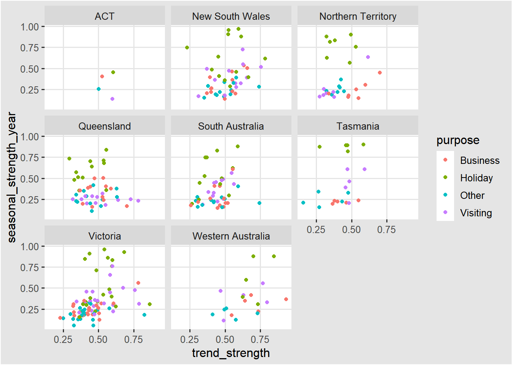
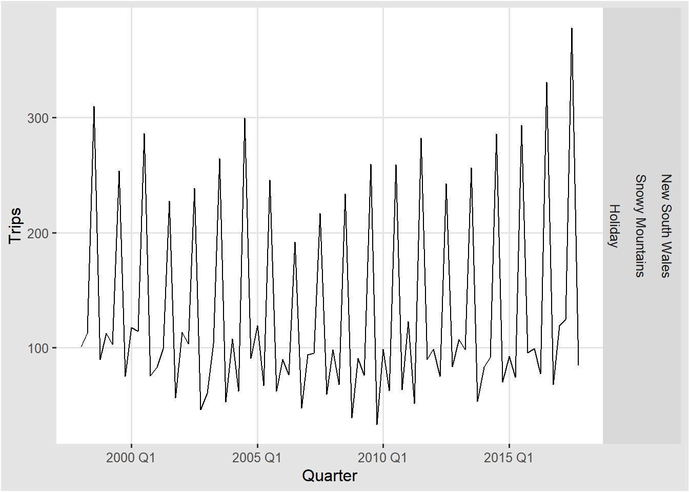

# 시계열의 특징 {#chap4}

`feats`패키지에는 **FE**atures **A**nd **S**tatistics from **T**ime **S**eries를 
computing하는 함수들이 있다. 
우리는 이미 시계열의 특징 몇가지를 앞에서 살펴보았다. 
예를 들면, autocorrelations(자기상관)이 시계열의 특징으로 제시되었다. 

## 몇가지 간단한 통계

features() 함수를 통해 평균, 최소값, 최댓값을 계산할 수 있다. 

### 평균

예를 들어, tourism 데이터(분기별 호주 여행객수)를 사용하여 **mean**으로 모든 시계열의 평균을 계산할 수 있다. 


```r
tourism %>%
  janitor::clean_names() %>% 
  features(trips, list(mean = mean)) %>%
  arrange(mean)
```

```
#> # A tibble: 304 x 4
#>    region          state              purpose   mean
#>    <chr>           <chr>              <chr>    <dbl>
#>  1 Kangaroo Island South Australia    Other    0.340
#>  2 MacDonnell      Northern Territory Other    0.449
#>  3 Wilderness West Tasmania           Other    0.478
#>  4 Barkly          Northern Territory Other    0.632
#>  5 Clare Valley    South Australia    Other    0.898
#>  6 Barossa         South Australia    Other    1.02 
#>  7 Kakadu Arnhem   Northern Territory Other    1.04 
#>  8 Lasseter        Northern Territory Other    1.14 
#>  9 Wimmera         Victoria           Other    1.15 
#> 10 MacDonnell      Northern Territory Visiting 1.18 
#> # ... with 294 more rows
```
South Australia 주에 있는 캥거루 섬을 방문한 평균 방문객 수가 가장 적었다는 것을 알 수 있다. 

### 사분위수

**quantile**을 통해 최소값, 제1사분위수, 중위수, 제3사분위수, 최대값을 계산할 수 있다. 


```r
tourism %>% 
    janitor::clean_names() %>% 
    features(trips, quantile)
```

```
#> # A tibble: 304 x 8
#>    region         state             purpose    `0%`  `25%`   `50%`  `75%` `100%`
#>    <chr>          <chr>             <chr>     <dbl>  <dbl>   <dbl>  <dbl>  <dbl>
#>  1 Adelaide       South Australia   Busine~  68.7   134.   153.    177.   242.  
#>  2 Adelaide       South Australia   Holiday 108.    135.   154.    172.   224.  
#>  3 Adelaide       South Australia   Other    25.9    43.9   53.8    62.5  107.  
#>  4 Adelaide       South Australia   Visiti~ 137.    179.   206.    229.   270.  
#>  5 Adelaide Hills South Australia   Busine~   0       0      1.26    3.92  28.6 
#>  6 Adelaide Hills South Australia   Holiday   0       5.77   8.52   14.1   35.8 
#>  7 Adelaide Hills South Australia   Other     0       0      0.908   2.09   8.95
#>  8 Adelaide Hills South Australia   Visiti~   0.778   8.91  12.2    16.8   81.1 
#>  9 Alice Springs  Northern Territo~ Busine~   1.01    9.13  13.3    18.5   34.1 
#> 10 Alice Springs  Northern Territo~ Holiday   2.81   16.9   31.5    44.8   76.5 
#> # ... with 294 more rows
```
0%는 최소값을 의미하고, 100%는 최대값을 의미한다. 

### ETC

list()를 통해 평균과 최소값, 제1사분위수, 중위수, 제3사분위수, 최대값을 한번에 계산할 수 있다. 


```r
tourism %>% 
    janitor::clean_names() %>% 
    features(trips, list(avg = mean, quantile))
```

```
#> # A tibble: 304 x 9
#>    region         state      purpose    avg    `0%`  `25%`   `50%`  `75%` `100%`
#>    <chr>          <chr>      <chr>    <dbl>   <dbl>  <dbl>   <dbl>  <dbl>  <dbl>
#>  1 Adelaide       South Aus~ Busine~ 156.    68.7   134.   153.    177.   242.  
#>  2 Adelaide       South Aus~ Holiday 157.   108.    135.   154.    172.   224.  
#>  3 Adelaide       South Aus~ Other    56.6   25.9    43.9   53.8    62.5  107.  
#>  4 Adelaide       South Aus~ Visiti~ 205.   137.    179.   206.    229.   270.  
#>  5 Adelaide Hills South Aus~ Busine~   2.66   0       0      1.26    3.92  28.6 
#>  6 Adelaide Hills South Aus~ Holiday  10.5    0       5.77   8.52   14.1   35.8 
#>  7 Adelaide Hills South Aus~ Other     1.40   0       0      0.908   2.09   8.95
#>  8 Adelaide Hills South Aus~ Visiti~  14.2    0.778   8.91  12.2    16.8   81.1 
#>  9 Alice Springs  Northern ~ Busine~  14.6    1.01    9.13  13.3    18.5   34.1 
#> 10 Alice Springs  Northern ~ Holiday  31.9    2.81   16.9   31.5    44.8   76.5 
#> # ... with 294 more rows
```

## ACF

자기 상관(Autocorrelation)을 앞서 1장에서 배웠다. 

### feat_acf
자기 상관은 feat_acf를 이용하여 ACF에 관한 정보를 얻을 수 있다. 

* acf1: 시계열 데이터의 1차 자기상관계수

* acf10: 1~10차 자기상관계수 제곱합 

* diff1_acf1: 1차 차분 시계열의 1차 자기상관계수

* diff1_acf10: 1차 차분 시계열의 1~10차 자기상관계수 제곱합 

* diff2_acf1: 2차 차분 시계열의 1차 자기상관계수

* diff2_acf10: 2차 차분 시계열의 1~10차 자기상관계수 제곱합 

* season_acf1: 첫번째 계절 시차에서의 자기상관계수 


```r
tourism %>% 
    janitor::clean_names() %>% 
    features(trips, feat_acf)
```

```
#> # A tibble: 304 x 10
#>    region         state purpose     acf1 acf10 diff1_acf1 diff1_acf10 diff2_acf1
#>    <chr>          <chr> <chr>      <dbl> <dbl>      <dbl>       <dbl>      <dbl>
#>  1 Adelaide       Sout~ Busine~  0.0333  0.131     -0.520       0.463     -0.676
#>  2 Adelaide       Sout~ Holiday  0.0456  0.372     -0.343       0.614     -0.487
#>  3 Adelaide       Sout~ Other    0.517   1.15      -0.409       0.383     -0.675
#>  4 Adelaide       Sout~ Visiti~  0.0684  0.294     -0.394       0.452     -0.518
#>  5 Adelaide Hills Sout~ Busine~  0.0709  0.134     -0.580       0.415     -0.750
#>  6 Adelaide Hills Sout~ Holiday  0.131   0.313     -0.536       0.500     -0.716
#>  7 Adelaide Hills Sout~ Other    0.261   0.330     -0.253       0.317     -0.457
#>  8 Adelaide Hills Sout~ Visiti~  0.139   0.117     -0.472       0.239     -0.626
#>  9 Alice Springs  Nort~ Busine~  0.217   0.367     -0.500       0.381     -0.658
#> 10 Alice Springs  Nort~ Holiday -0.00660 2.11      -0.153       2.11      -0.274
#> # ... with 294 more rows, and 2 more variables: diff2_acf10 <dbl>,
#> #   season_acf1 <dbl>
```
tourism 데이터(분기별 호주 여행객수)는 분기별 데이터이기 때문에 위 결과에서 season_acf1은 시차 4에서의 자기상관계수값을 의미한다. 

## STL
 
STL분해는 3장에서도 언급되었다. 
STL은 Seasonal and Trend decomposition using Loess의 줄임말로 robust한 시계열 분해 방법에 해당된다. 

시계열 분해는 추세요소$T_{t}$, 계절요소$S_{t}$, 관측치 $y_{t}$에서 추세요소와 계절 요소를 뺀 나머지 부분인 $R_{t}$로 나누어 볼 수 있었다. 

\[
y_{t}=T_{t}+S_{t}+R_{t}
\]

강한 추세를 가진 데이터의 경우, 계절 조덩된 데이터가 $R_{t}$보다 더 큰 변동을 가져야 한다.
그러므로 $\frac{var(R_{t})}{var(T_{t}+R_{t})}$는 상대적으로 작아진다. 
추세의 강도는 아래와 같이 정의되며, 0과 1사이의 값을 가진다. 

\[
F_{t}=max(0,1-\frac{var(R_{t})}{var(T_{t}+R_{t})})
\]

계절성의 강도는 아래와 같이 정의된다. 

\[
F_{s}=max(0,1-\frac{var(R_{t})}{var(S_{t}+R_{t})})
\]

### feat_stl
feat_stl을 이용하여 STL 분해 요소를 얻을 수 있다. 
추세와 계절성의 강도와 함께 아래와 같은 값들도 얻을 수 있다. 

* seasonal_peak_year: 계절성이 가장 큰 시점

* seasonal_trough_year: 계절성이 가장 작은 시점

* spikiness: $R_{t}$의 분산

* linearity: $T_{t}$(추세요소)의 선형성

* curvature: $T_{t}$(추세요소)의 곡률

* stl_e_acf1: 추세요소$T_{t}$와 계절요소$S_{t}$를 제외한 나머지 계열들의 1차 자기상관계수

* stl_e_acf10: 추세요소$T_{t}$와 계절요소$S_{t}$를 제외한 나머지 계열들의 1~10차 자기상관계수 제곱합


```r
tourism %>%
  janitor::clean_names() %>% 
  features(trips, feat_stl)
```

```
#> # A tibble: 304 x 12
#>    region         state purpose trend_strength seasonal_streng~ seasonal_peak_y~
#>    <chr>          <chr> <chr>            <dbl>            <dbl>            <dbl>
#>  1 Adelaide       Sout~ Busine~          0.464            0.407                3
#>  2 Adelaide       Sout~ Holiday          0.554            0.619                1
#>  3 Adelaide       Sout~ Other            0.746            0.202                2
#>  4 Adelaide       Sout~ Visiti~          0.435            0.452                1
#>  5 Adelaide Hills Sout~ Busine~          0.464            0.179                3
#>  6 Adelaide Hills Sout~ Holiday          0.528            0.296                2
#>  7 Adelaide Hills Sout~ Other            0.593            0.404                2
#>  8 Adelaide Hills Sout~ Visiti~          0.488            0.254                0
#>  9 Alice Springs  Nort~ Busine~          0.534            0.251                0
#> 10 Alice Springs  Nort~ Holiday          0.381            0.832                3
#> # ... with 294 more rows, and 6 more variables: seasonal_trough_year <dbl>,
#> #   spikiness <dbl>, linearity <dbl>, curvature <dbl>, stl_e_acf1 <dbl>,
#> #   stl_e_acf10 <dbl>
```

위의 결과를 x축은 트렌드한 정도를, y축은 계절적인 정도를 표현해서 아래와 같이 시각화할 수 있다. 

```r
tourism %>%
  janitor::clean_names() %>% 
  features(trips, feat_stl) %>% 
  ggplot(aes(x = trend_strength, y = seasonal_strength_year,
             col = purpose)) +
  geom_point() +
  facet_wrap(vars(state))
```


휴가를 목적으로 하는 관광이 계절성의 강도가 가장 큰 것을 보여준다. 


```r
tourism %>%
  features(Trips, feat_stl) %>%
  filter(seasonal_strength_year == max(seasonal_strength_year)) %>%
  left_join(tourism, by = c("State", "Region", "Purpose")) %>%
  ggplot(aes(x = Quarter, y = Trips)) +
  geom_line() +
  facet_grid(vars(State, Region, Purpose))
```




