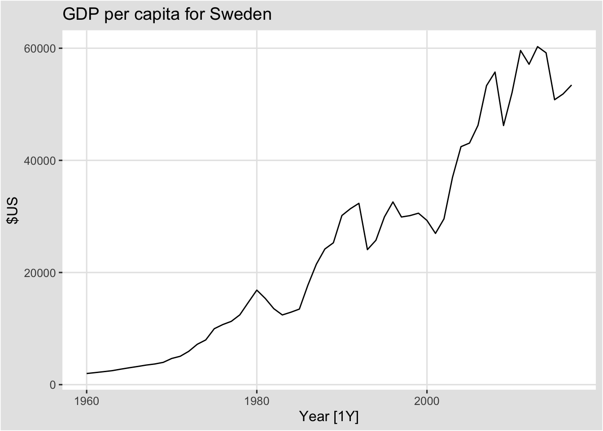
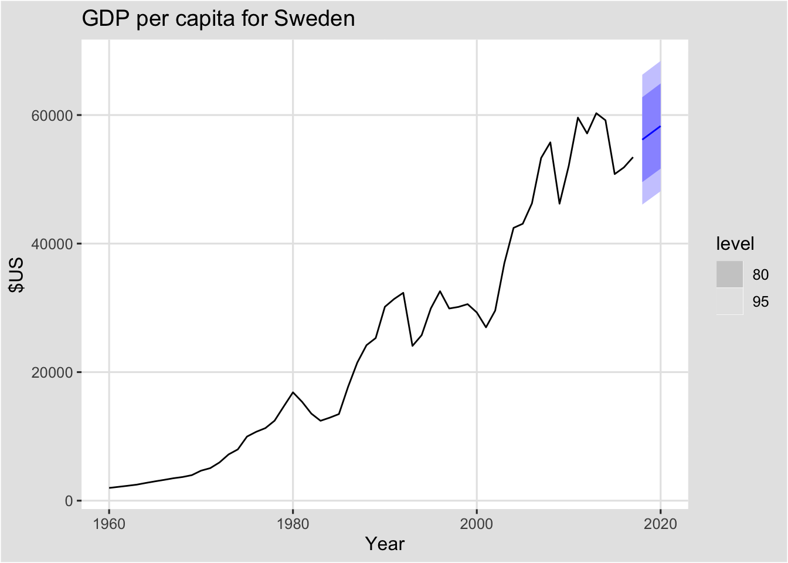
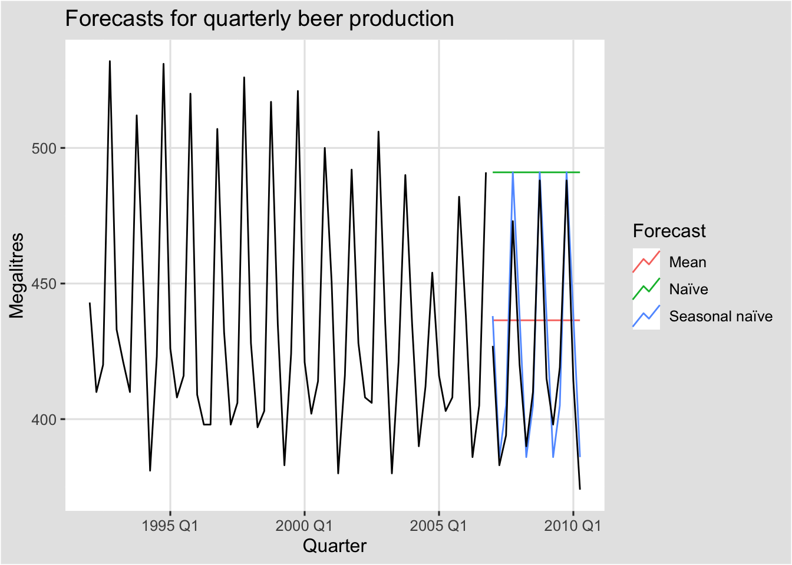
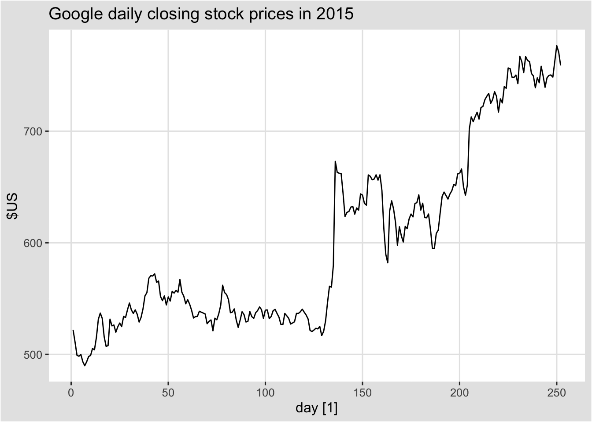
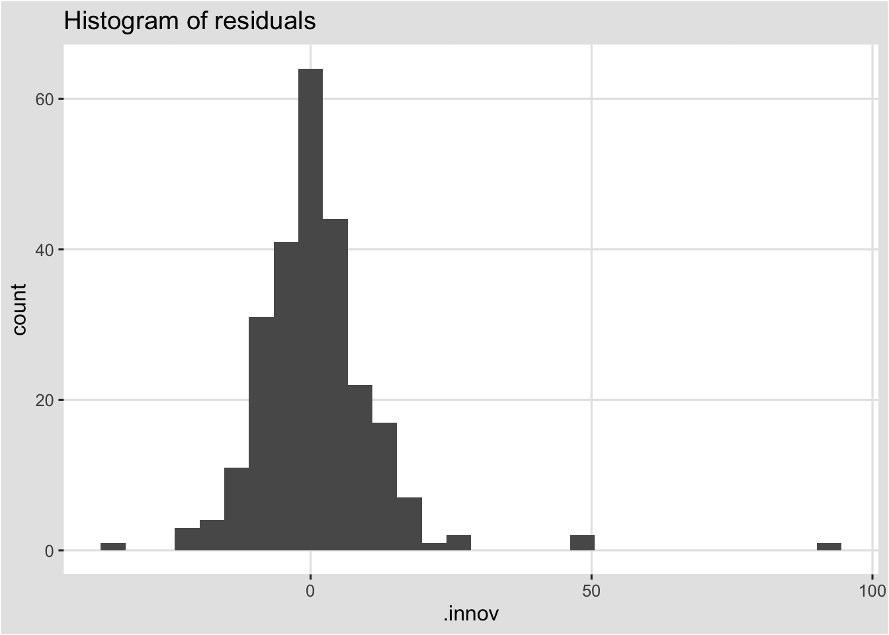
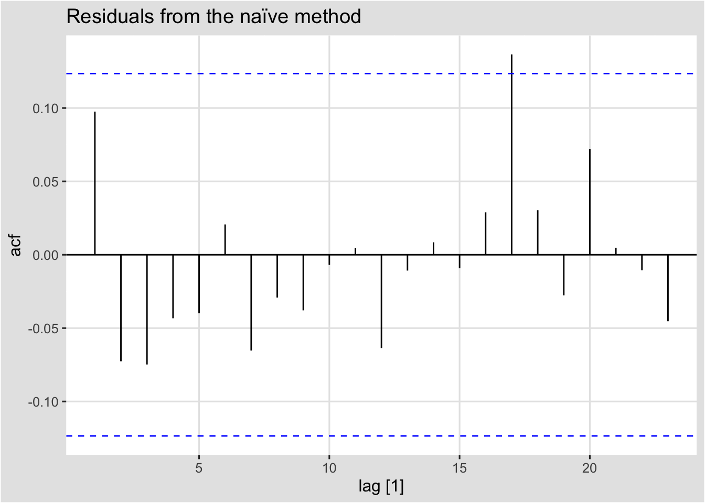
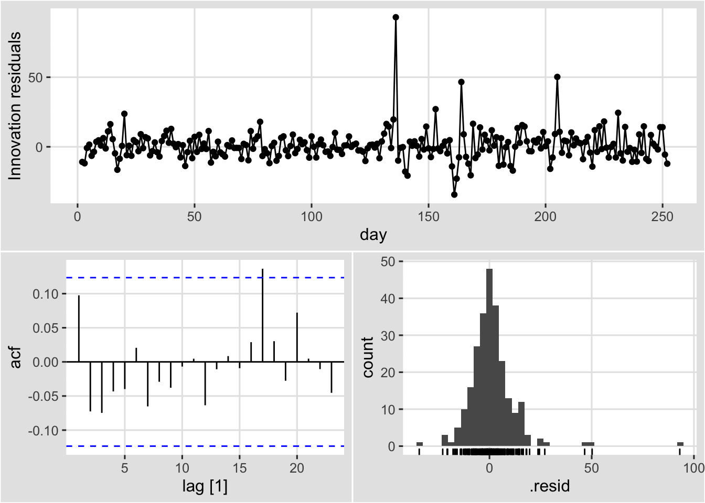

---
editor_options:
  markdown:
    wrap: 72
---

# 예측을 위한 도구상자 {#chap5}

이 장의 학습목표는,

## tidy한 예측 절차

시계열 데이터를 이용한 예측 절차는 다음과 같다.


예측 절차를 설명하기 위해 국가별 GDP 데이터에 선형추세모형을 적합시킬
것이다.

### 데이터 준비

예측의 첫 번째 단계는 올바른 형식으로 데이터를 준비하는 것이다. 이
단계에는 데이터 불러오기, 결측값 식별, 시계열 필터링 및 기타 사전 처리
작업이 포함된다. `tisibble`, `tidyverse`를 이용하면 이 단계를 단순화할
수 있다.


```r
global_economy %>% head()
```

```
#> # A tsibble: 6 x 9 [1Y]
#> # Key:       Country [1]
#>   Country     Code   Year         GDP Growth   CPI Imports Exports Population
#>   <fct>       <fct> <dbl>       <dbl>  <dbl> <dbl>   <dbl>   <dbl>      <dbl>
#> 1 Afghanistan AFG    1960  537777811.     NA    NA    7.02    4.13    8996351
#> 2 Afghanistan AFG    1961  548888896.     NA    NA    8.10    4.45    9166764
#> 3 Afghanistan AFG    1962  546666678.     NA    NA    9.35    4.88    9345868
#> 4 Afghanistan AFG    1963  751111191.     NA    NA   16.9     9.17    9533954
#> 5 Afghanistan AFG    1964  800000044.     NA    NA   18.1     8.89    9731361
#> 6 Afghanistan AFG    1965 1006666638.     NA    NA   21.4    11.3     9938414
```

시간에 따른 1인당 GDP에 대해 모델링할 것이므로, 먼저 관련 변수를
생성한다.


```r
gdppc <- global_economy %>%
  mutate(GDP_per_capita = GDP / Population)
```

### 데이터 시각화

2장에서 보았듯이 시각화는 데이터를 이해하는데 필수적인 단계이다.
데이터를 보면 일반적인 패턴을 식별하고, 적절한 모형을 지정할 수 있다.


```r
gdppc %>%
  filter(Country == "Sweden") %>%
  autoplot(GDP_per_capita) +
  labs(y = "$US", title = "GDP per capita for Sweden")
```



### 모델 정의

예측에 사용할 수 있는 다양한 시계열 모형이 있다. 데이터에 맞는 적절한
시계열 모형을 지정하는 것은 정확한 예측을 수행하는데 필수적이다. 예를
들어, 1인당 GDP에 대한 선형 추세 모형을 다음과 같이 지정할 수 있다.


```r
TSLM(GDP_per_capita ~ trend())
```

이 경우 모형 함수는 `TSLM()`이고, 반응변수는 GDP_per_capita, 설명변수는
`trend()`(선형 추세를 지정하는 함수)이다.

모형의 구조를 정의하는데 사용하는 특정 함수는 모형마다 다르게
정의된다(각 모형이 다른 구조를 지원할 수 있기 때문에). 각 모형에 대한
특정 함수 목록과 설명은 "Special" 챕터에서 볼 수 있다.

### 모델 학습

적절한 모형이 지정되면 일부 데이터에 대해 학습을 진행한다. model()
함수를 이용해서 하나 이상의 모델의 을 적합시킬 수 있다.


```r
fit <- gdppc %>%
  model(trend_model = TSLM(GDP_per_capita ~ trend()))
fit
```

```
#> # A mable: 263 x 2
#> # Key:     Country [263]
#>    Country             trend_model
#>    <fct>                   <model>
#>  1 Afghanistan              <TSLM>
#>  2 Albania                  <TSLM>
#>  3 Algeria                  <TSLM>
#>  4 American Samoa           <TSLM>
#>  5 Andorra                  <TSLM>
#>  6 Angola                   <TSLM>
#>  7 Antigua and Barbuda      <TSLM>
#>  8 Arab World               <TSLM>
#>  9 Argentina                <TSLM>
#> 10 Armenia                  <TSLM>
#> # ... with 253 more rows
```

tsibble의 주요 변수의 각 조합에 대한 1인당 GDP 데이터에 대해서 선형 추세
모형을 적합시킨 것이다. 이 예시에서는 263개 국가 각각에 해당 모형을
적합시킨다. 적합 결과 object는 model table이나 "mable" 형태이다.

각 행은 key 변수 중 하나의 조합에 해당한다. trend_model 열에는 각 국가에
대해 적합시킨 모델에 대한 결과가 포함된다. 마지막 챕터에서 각 모델에
대해 더 많은 정보를 얻는 방법을 익힐 것이다.

### 모델 성능 검증

모델을 적합시킨 후, 데이터에 모델이 얼마나 잘 적합되었는지 확인하는 것이
중요하다. 모델을 검증하기 위한 몇 가지 진단 도구가 있으며, 모델 간
비교를 위한 정확성 측도가 있다. 자세한 내용은 5.8, 5.9 챕터에서
설명한다.

### 예측

적절한 모형을 선택하고, 추정 및 확인을 한후 예측을 할 때 사용하는 것이
`forecast()`이다. 이 함수를 사용하는 가장 쉬운 방법은 예측할 미래 관측치
수를 지정하는 것이다. 예를 들어, 다음 10개의 관측치에 대한 예측값은
`h=10`을 이용해서 생성할 수 있다. 또다른 예시로 2년 후 미래에 대한
예측값은 `h = "2 years"`를 이용해서 생성할 수 있다. 또는 예측할 미래
기간에 해당하는 데이터셋을 사전에 만드는 것이 편리할 수도 있다. 모델에
외생변수와 같은 데이터의 추가 정보를 사용할 때 일반적으로 필요하다.
모델에 필요한 추가적인 데이터는 예측할 관측 데이터셋에 포함될 수 있다.


```r
fit %>% forecast(h = "3 years")
```

```
#> # A fable: 789 x 5 [1Y]
#> # Key:     Country, .model [263]
#>    Country        .model       Year   GDP_per_capita  .mean
#>    <fct>          <chr>       <dbl>           <dist>  <dbl>
#>  1 Afghanistan    trend_model  2018     N(526, 9653)   526.
#>  2 Afghanistan    trend_model  2019     N(534, 9689)   534.
#>  3 Afghanistan    trend_model  2020     N(542, 9727)   542.
#>  4 Albania        trend_model  2018  N(4716, 476419)  4716.
#>  5 Albania        trend_model  2019  N(4867, 481086)  4867.
#>  6 Albania        trend_model  2020  N(5018, 486012)  5018.
#>  7 Algeria        trend_model  2018  N(4410, 643094)  4410.
#>  8 Algeria        trend_model  2019  N(4489, 645311)  4489.
#>  9 Algeria        trend_model  2020  N(4568, 647602)  4568.
#> 10 American Samoa trend_model  2018 N(12491, 652926) 12491.
#> # ... with 779 more rows
```

각 행은 각 국가에 대한 하나의 예측 기간에 해당한다.
`GDP_per_capita`열에는 예측 분포가 포함되고, `.mean`열에는 예측값이
포함된다. 예측값은 예측분포의 평균이다.

과거 데이터를 포함한 예측 시각화는 `autoplot()`을 이용할 수 있다.


```r
fit %>%
  forecast(h = "3 years") %>%
  filter(Country == "Sweden") %>%
  autoplot(gdppc) +
  labs(y = "$US", title = "GDP per capita for Sweden")
```



## 몇가지 간단한 예측 방법

일부 예측 방법은 매우 간단하고 효과적이다. 이 책 전체에서 벤치마크로 네
가지 간단한 예측방법을 사용할 것이다. 이를 설명하기 위해 먼저 1970년부터
2004년까지 분기별 호주 벽돌 생산량 데이터를 사용할 것이다.


```r
aus_production
```

```
#> # A tsibble: 218 x 7 [1Q]
#>    Quarter  Beer Tobacco Bricks Cement Electricity   Gas
#>      <qtr> <dbl>   <dbl>  <dbl>  <dbl>       <dbl> <dbl>
#>  1 1956 Q1   284    5225    189    465        3923     5
#>  2 1956 Q2   213    5178    204    532        4436     6
#>  3 1956 Q3   227    5297    208    561        4806     7
#>  4 1956 Q4   308    5681    197    570        4418     6
#>  5 1957 Q1   262    5577    187    529        4339     5
#>  6 1957 Q2   228    5651    214    604        4811     7
#>  7 1957 Q3   236    5317    227    603        5259     7
#>  8 1957 Q4   320    6152    222    582        4735     6
#>  9 1958 Q1   272    5758    199    554        4608     5
#> 10 1958 Q2   233    5641    229    620        5196     7
#> # ... with 208 more rows
```

**filter_index(.data, ...)**

-   .data : tsibble

-   ... : start \~ end 또는 \~ end(. \~ end), start \~ .


```r
bricks <- aus_production %>%
  filter_index("1970 Q1" ~ "2004 Q4") %>%
  select(Bricks)

bricks
```

```
#> # A tsibble: 140 x 2 [1Q]
#>    Bricks Quarter
#>     <dbl>   <qtr>
#>  1    386 1970 Q1
#>  2    428 1970 Q2
#>  3    434 1970 Q3
#>  4    417 1970 Q4
#>  5    385 1971 Q1
#>  6    433 1971 Q2
#>  7    453 1971 Q3
#>  8    436 1971 Q4
#>  9    399 1972 Q1
#> 10    461 1972 Q2
#> # ... with 130 more rows
```

### Mean method

Mean method에서 모든 미래 관측치에 대한 예측은 과거 데이터의 평균과
같다. 과거 데이터를 $y_1, \cdots, y_T$로 표기한다면, 미래 예측치는
다음과 같이 표현할 수 있다.

$$
\hat{y}_{T+h|T} = \bar{y} = (y_1, \cdots y_T)/T
$$ $\hat{y}_{T+h|T}$는 $y_1, \cdots, y_T$를 이용한 $y_{T+h}$의
추정치이다.


```r
bricks %>% model(MEAN(Bricks)) %>% report()
```

```
#> Series: Bricks 
#> Model: MEAN 
#> 
#> Mean: 450.8786 
#> sigma^2: 3993.2441
```

### Naive method

Naive method에서 모든 미래 관측치에 대한 예측은 마지막 관측치 값과 같다.
즉 다음과 같이 표현할 수 있다.

$$
\hat{y}_{T+h|T} = y_T
$$


```r
bricks %>% model(NAIVE(Bricks)) %>% report()
```

```
#> Series: Bricks 
#> Model: NAIVE 
#> 
#> sigma^2: 1974.3053
```

### Seasonal naive method

Seasonal naive method는 Naive method와 유사한 방법으로 계절성이 높은
데이터에 유용하다. Seasonal naive method에서 모든 미래 관측치에 대한
예측은 같은 시즌(예시. 전년도 같은달)의 마지막 관측값으로 한다.

$$
\hat{y}_{T+h|T} = y_{T+h-m(k+1)}
$$ 여기서, $m$은 seasonal period이고, $k$는 $(h-1)/m$의 정수값이다. 예를
들어 월별 데이터에서, 모든 2월에 대한 예측값은 작년 2월의 값으로 한다.


```r
bricks %>% model(SNAIVE(Bricks ~ lag("year"))) %>% 
  forecast(h = "5 years") %>% head()
```

```
#> # A fable: 6 x 4 [1Q]
#> # Key:     .model [1]
#>   .model                           Quarter       Bricks .mean
#>   <chr>                              <qtr>       <dist> <dbl>
#> 1 "SNAIVE(Bricks ~ lag(\"year\"))" 2005 Q1 N(409, 3026)   409
#> 2 "SNAIVE(Bricks ~ lag(\"year\"))" 2005 Q2 N(423, 3026)   423
#> 3 "SNAIVE(Bricks ~ lag(\"year\"))" 2005 Q3 N(428, 3026)   428
#> 4 "SNAIVE(Bricks ~ lag(\"year\"))" 2005 Q4 N(397, 3026)   397
#> 5 "SNAIVE(Bricks ~ lag(\"year\"))" 2006 Q1 N(409, 6053)   409
#> 6 "SNAIVE(Bricks ~ lag(\"year\"))" 2006 Q2 N(423, 6053)   423
```

### Drift method

naive method의 변형은 시간이 지남에 따라 예측값이 증가하거나 감소하는
것이다. 여기서 시간에 따른 변화량(drift)는 과거 시점의 평균 변화의
집합이다. 따라서 미래 $T+h$ 예측치는 다음과 같이 표현할 수 있다.

$$
\hat{y}_{T+h|T} = y_T + \frac{h}{T-1} \sum_{t = 2}^T (y_t - y_{t-1}) = y_T + h(\frac{y_T - y_1}{T-1})
$$

이는 첫 번째와 마지막 관측치 사이의 직선을 이용해서 예측하는 것과 동일하다.


```r
bricks %>% model(RW(Bricks ~ drift())) %>% report()
```

```
#> Series: Bricks 
#> Model: RW w/ drift 
#> 
#> Drift: 0.0791 (se: 3.7688)
#> sigma^2: 1974.3053
```


```r
# aus_production from 1992 to 2010
# Set training data from 1992 to 2006
train <- aus_production %>%
  filter_index("1992 Q1" ~ "2006 Q4")
# Fit the models
beer_fit <- train %>%
  model(
    Mean = MEAN(Beer),
    `Naïve` = NAIVE(Beer),
    `Seasonal naïve` = SNAIVE(Beer)
  )
beer_fit
```

```
#> # A mable: 1 x 3
#>      Mean   Naive `Seasonal naive`
#>   <model> <model>          <model>
#> 1  <MEAN> <NAIVE>         <SNAIVE>
```


```r
# Generate forecasts for 14 quarters
beer_fc <- beer_fit %>% forecast(h = 14)
beer_fc
```

```
#> # A fable: 42 x 4 [1Q]
#> # Key:     .model [3]
#>    .model Quarter         Beer .mean
#>    <chr>    <qtr>       <dist> <dbl>
#>  1 Mean   2007 Q1 N(436, 1996)  436.
#>  2 Mean   2007 Q2 N(436, 1996)  436.
#>  3 Mean   2007 Q3 N(436, 1996)  436.
#>  4 Mean   2007 Q4 N(436, 1996)  436.
#>  5 Mean   2008 Q1 N(436, 1996)  436.
#>  6 Mean   2008 Q2 N(436, 1996)  436.
#>  7 Mean   2008 Q3 N(436, 1996)  436.
#>  8 Mean   2008 Q4 N(436, 1996)  436.
#>  9 Mean   2009 Q1 N(436, 1996)  436.
#> 10 Mean   2009 Q2 N(436, 1996)  436.
#> # ... with 32 more rows
```


```r
beer_fc %>%
  autoplot(train, level = NULL) + # level = NULL : 예측구간 x
  autolayer(
    filter_index(aus_production, "2007 Q1" ~ .),
    colour = "black"
  ) +
  labs(
    y = "Megalitres",
    title = "Forecasts for quarterly beer production"
  ) +
  guides(colour = guide_legend(title = "Forecast"))
```



## fitted value and residuals

### fitted value 

시계열의 각 관찰값은 모든 이전 시점 관찰값을 이용해서 예측할 수 있습니다. 이를 적합값(fitted value)으로 표현하며, 기호로는 $\hat{y}_{t|t-1}$로 표기한다. 아래첨자를 생략하고 $\hat{y}_{t|t-1}$ 대신에 $\hat{y}_t$로 표기할 수도 있다. 적합값은 대부분 한단계 예측치(one-step forecast)를 포함한다. 

사실, 적합값은 미래 예측값을 포함하여, 사용할 수 있는 모든 관측값으로 예측 기법에 들어가는 매개변수를 추정했기 때문에 진짜 예측값이 아니다. 예를 들어, mean method를 이용했을 때 적합값은 다음과 같다. 

$$
\hat{y}_t = \hat{c}
$$
$\hat{c}$는 $t$ 시점 이후 관측값을 포함하여 이용가능한 모든 관측값에 대한 평균이다. 유사하게, 표류 기법(drift method)에서는 표류 매개변수는 모든 이용가능한 관측값을 이용해서 추정된다. 이 경우에, 적합값은 다음과 같다. 
$$
\hat{y}_t = y_{t-1} + \hat{c}, \, \hat{c} = \frac{y_T - y_1}{T-1}
$$
두 경우 모두, 데이터를 이용해서 추정한 매개변수가 있다. $\hat{c}$에 $t$ 시점 이후의 관측치가 포함될 때, 적합값은 진짜 예측치가 아니다. 반면에, 나이브 혹은 나이브 계절성 예측에는 어떠한 매개변수도 없기 때문에, 이 경우에는 적합값이 진짜 예측치가 된다.  

### residuals 

시계열 모형에서 잔차는 모델을 적합시킨 후에 남은 것을 의미한다. 즉, 잔차는 관측값과 적합값의 차이로 표현된다. 

$$
e_t = y_t - \hat{y_t}
$$
만약 모형에 변환이 사용된 경우, 변환된 척도에서 잔차를 확인하는 것이 유용할 수 있다. 이것을 주로 **"innovation residuals"**라고 부른다. 예를 들어, 데이터에 로그변환을 했다고 가정했을 때($w_t = log(y_t)$), innovation residuals은 $w_t - \hat{w_t}$로 표기할 수 있고, 반면에 regular residuals는 $y_t - \hat{y}_t$로 표기할 수 있다. 변환을 수행하지 않았다면 innovation residuals와 regular residuals는 동일하며, 이 경우 우리는 단순하게 "residuals"라고 표기한다. 

모델로부터 적합값과 잔차는 `augument()` 함수를 이용해서 구할 수 있다. 섹션 5.2 맥주 생산량 예시에서, 우리는 `beer_fit`으로 적합시킨 모형을 저장했다. 그래서 단순하게 `augument()`를 이용해서 모든 모형에 대한 적합값과 잔차를 계산할 수 있다. 


```r
augment(beer_fit)
```

```
#> # A tsibble: 180 x 6 [1Q]
#> # Key:       .model [3]
#>    .model Quarter  Beer .fitted .resid .innov
#>    <chr>    <qtr> <dbl>   <dbl>  <dbl>  <dbl>
#>  1 Mean   1992 Q1   443    436.   6.55   6.55
#>  2 Mean   1992 Q2   410    436. -26.4  -26.4 
#>  3 Mean   1992 Q3   420    436. -16.4  -16.4 
#>  4 Mean   1992 Q4   532    436.  95.6   95.6 
#>  5 Mean   1993 Q1   433    436.  -3.45  -3.45
#>  6 Mean   1993 Q2   421    436. -15.4  -15.4 
#>  7 Mean   1993 Q3   410    436. -26.4  -26.4 
#>  8 Mean   1993 Q4   512    436.  75.6   75.6 
#>  9 Mean   1994 Q1   449    436.  12.6   12.6 
#> 10 Mean   1994 Q2   381    436. -55.4  -55.4 
#> # ... with 170 more rows
```

원본 데이터에 새롭게 3개의 열에 추가되었다. 

-   `.fitted` : 적합값을 의미함

-   `.resid` : 잔차를 의미함 

-   `.innov` : "innovation residuals"를 의미함(현재 예시에서는 변환을 하지 않았기 때문에 regular residuals와 동일함)

잔차는 모형이 데이터의 정보를 적절하게 잡아냈는지 여부를 확인하는데 유용하다. 이를 위해, "innovation residuals"를 이용한다. "innovation residuals"에서 패턴이 존재할 경우, 해당 모형은 개선이 필요하다. 다음 섹션에서 잔차의 패턴을 탐색하기 위한 도구들을 살펴본다.  


## Residuals diagnistics 

좋은 예측 방법은 다음과 같은 특성을 갖는 "innovation residuals"을 산출합니다. 


1. "innovation residuals" 사이에 상관관계가 없다. "innovation residuals" 사이에 상관관계가 있다면, 잔차에는 예측값을 계산할 때 사용해야 하는 정보가 남아있다는 것을 의미한다. 

2. "innovation residuals"의 평균이 0이다. 잔차의 평균이 0이 아닐 경우, 예측값이 편향되었음을 의미한다. 

이러한 특성을 만족하지 않는 모든 예측 방법은 개선될 수 있다. 그러나 이 말이 이러한 특성을 만족하는 예측 방법이 개선될 수 없다는 것은 아니다. 동일한 데이터에 대해 이러한 특성을 만족하는 여러가지 다양한 예측 방법을 사용할 수 있다. 이러한 특성을 확인하는 것은 어떤 모델이 사용할 수 있는 모든 정보를 사용했는지 여부를 확인하기 위해 중요한 것이지만, 예측 방법을 선택하는데 좋은 방법은 아니다.

이러한 특성 중 하나라도 만족되지 않는다면, 예측 방법을 수정해서 더 나은 예측을 제공할 수 있다. 편향을 보정하는 것은 쉽다: 잔차의 평균이 $m$일 경우, 단순하게 모든 예측치에 $m$을 뺌으로서, 편향을 보정할 수 있다. 상관(correlation) 문제를 개선하는 것은 어렵고, 챕터 10까지 관련 내용은 다루지 않을 것이다. 

이러한 핵심 특성뿐만 아니라 (필수적이지않지만) 다음과 같은 잔차의 두 가지 특성도 유용할 수 있다. 

3.  "innovation residuals"의 분산이 상수이다. 이는 등분산성을 의미한다.

4. "innovation residuals"가 정규분포를 따른다. 

추가적인 두 가지 특성은 예측 구간을 쉽게 계산할 수 있게 만든다(섹션 5.5의 예시 참고). 그러나 이러한 특성을 만족하지 않는 예측 방법을 반드시 개선할 수 있는 것은 아니다. 보통 박스-콕스 변환은 이러한 특성을 만족시키기 위해 도움이 될 수 있지만, 일반적으로 등분산성과 정규성을 만족하기 위해 할 수 있는 것은 거의 없다. 대신에, 예측 구간을 얻기 위한 대안적인 접근이 필요하다. 섹션 5.5에 정규성을 만족하지 않는 "innovation residuals"을 다루는 방법에 대해 알아본다. 

## 예 : 구글 일일 종가 예측 

주식시장 가격과 지수의 경우, 가장 좋은 예측 방법은 주로 `naive method`이다. 즉, 각 예측값은 단순하게 마지막 관측치 값과 동일하다. ($\hat{y}_t = y_{t-1}$). 따라서, 잔차는 단순하게 인접 관측치 사이의 차이와 동일하다.

$$
e_t = y_t - \hat{y}_t = y_t - y_{t-1}
$$
다음 그래프는 2015년의 구글 일일 종가의 추이를 보여준다. 가장 큰 폭의 상승은 2015년 7월 17일에 해당하며, 예상치 못한 2분기 실적으로 인해 16& 상승했다.  


```r
gafa_stock
```

```
#> # A tsibble: 5,032 x 8 [!]
#> # Key:       Symbol [4]
#>    Symbol Date        Open  High   Low Close Adj_Close    Volume
#>    <chr>  <date>     <dbl> <dbl> <dbl> <dbl>     <dbl>     <dbl>
#>  1 AAPL   2014-01-02  79.4  79.6  78.9  79.0      67.0  58671200
#>  2 AAPL   2014-01-03  79.0  79.1  77.2  77.3      65.5  98116900
#>  3 AAPL   2014-01-06  76.8  78.1  76.2  77.7      65.9 103152700
#>  4 AAPL   2014-01-07  77.8  78.0  76.8  77.1      65.4  79302300
#>  5 AAPL   2014-01-08  77.0  77.9  77.0  77.6      65.8  64632400
#>  6 AAPL   2014-01-09  78.1  78.1  76.5  76.6      65.0  69787200
#>  7 AAPL   2014-01-10  77.1  77.3  75.9  76.1      64.5  76244000
#>  8 AAPL   2014-01-13  75.7  77.5  75.7  76.5      64.9  94623200
#>  9 AAPL   2014-01-14  76.9  78.1  76.8  78.1      66.1  83140400
#> 10 AAPL   2014-01-15  79.1  80.0  78.8  79.6      67.5  97909700
#> # ... with 5,022 more rows
```


```r
google_stock <- gafa_stock %>%
  filter(Symbol == "GOOG", year(Date) >= 2015) %>%
  mutate(day = row_number()) %>%
  update_tsibble(index = day, regular = TRUE)
# Filter the year of interest
google_2015 <- google_stock %>% filter(year(Date) == 2015)
google_2015
```

```
#> # A tsibble: 252 x 9 [1]
#> # Key:       Symbol [1]
#>    Symbol Date        Open  High   Low Close Adj_Close  Volume   day
#>    <chr>  <date>     <dbl> <dbl> <dbl> <dbl>     <dbl>   <dbl> <int>
#>  1 GOOG   2015-01-02  526.  528.  521.  522.      522. 1447600     1
#>  2 GOOG   2015-01-05  520.  521.  510.  511.      511. 2059800     2
#>  3 GOOG   2015-01-06  512.  513.  498.  499.      499. 2899900     3
#>  4 GOOG   2015-01-07  504.  504.  497.  498.      498. 2065100     4
#>  5 GOOG   2015-01-08  495.  501.  488.  500.      500. 3353600     5
#>  6 GOOG   2015-01-09  502.  502.  492.  493.      493. 2069400     6
#>  7 GOOG   2015-01-12  492.  493.  485.  490.      490. 2322400     7
#>  8 GOOG   2015-01-13  496.  500.  490.  493.      493. 2370500     8
#>  9 GOOG   2015-01-14  492.  500.  490.  498.      498. 2235700     9
#> 10 GOOG   2015-01-15  503.  503.  495.  499.      499. 2715800    10
#> # ... with 242 more rows
```


```r
autoplot(google_2015, Close) +
  labs(y = "$US",
       title = "Google daily closing stock prices in 2015")
```



`naive method`를 이용해서 얻은 잔차 그림은 아래 그림과 같다. 큰 양의 잔차는 7월의 예상치 못한 가격 상승의 결과이다. 


```r
aug <- google_2015 %>%
  model(NAIVE(Close)) %>%
  augment()
autoplot(aug, .innov) +
  labs(y = "$US",
       title = "Residuals from the naïve method")
```


```r
aug %>%
  ggplot(aes(x = .innov)) +
  geom_histogram() +
  labs(title = "Histogram of residuals")
```




```r
aug %>%
  ACF(.innov) %>%
  autoplot() +
  labs(title = "Residuals from the naïve method")
```




이 그래프는 `naïve method`을 이용해서 사용할 수 있는 모든 정보를 설명한 것처럼 보이는 예측을 생성한다는 것을 보여준다. 잔차의 평균은 0에 가깝고, 잔차 사이에는 유의미한 상관관계가 없다. 잔차의 시간 그래프는 하나의 이상치를 제외하고 잔차의 변동이 과거와 동일하게 유지되는 것을 보여준다. 이러한 특징은 잔차의 히스토그램에서도 볼수 있다. 히스토그램은 잔차가 정규성을 만족하지 않는 것처럼 보인다. 이상치를 무시하더라고, 오른쪽으로 긴 꼬리를 갖는 분포로 보인다. 결과적으로, `naïve method`는 꽤 좋은 예측치를 제공하지만, 정규분포를 가정한 예측 구간에서는 부정확할 수 있다. 


이러한 잔차 진단 그래프를 생성하기 위한 더 간단한 방법은 `gg_tsresiduals()`이다. `gg_tsresiduals()`는 잔차의 시간 그래프, ACF 그래프, 잔차의 히스토그램을 생성한다. 

```r
google_2015 %>%
  model(NAIVE(Close)) %>%
  gg_tsresiduals()
```




## 자기상관에 대한 포트맨토 검정 

ACF 그래프를 확인하는 것뿐만 아니라, $r_k$을 개별적으로 다루는 것 대신 $r_k$의 전체 집합을 하나의 그룹으로 생각하여 자기 상관에 대한 검정을 할 수 있다. $r_k$가 lag $k$의 자기상관이라는 것을 상기하자. 

ACF 그래프에서 각 막대가 신뢰구간 안에 포함되는지를 볼 때, 우리는 암시적으로 다중 검정을 수행하고 있으며, 각 검정은 False Positive를 줄 가능성이 적다. 이러한 검정이 충분히 완료되면, 적어도 하나는 False Positive를 제공할 가능성이 높으므로, 실제로 그렇지 않은 경우에도 잔차에 자기상관이 남아있다고 결론을 내릴 수 있다. 

이러한 문제를 해결하기 위해, 처음 $l$개의 자기상관이 백색잡음과정에서 얻은 것과 다른지 여부를 검정한다. 자기상관 값의 그룹에 대한 검정을 여러가지 물품을 담고 있는 여행 가방이라는 프랑스 단어를 빌려 포트맨토 검정이라 한다. 

이러한 검정 중에 하나를 **Box-Pierce 검정**이라 하며, 검정통계량은 다음과 같다. 

$$
Q = T \sum_{k=1}^l r_k^2, 
$$

$l$은 최대 시차를 의미하며, $T$는 관측값의 수를 의미한다. 만약 $r_k$가 0에 가깝다면, $Q$는 작아질 것이다. 만약 $r_k$가 크다면, $Q$는 커질 것이다. 우리는 비계절형 데이터의 경우 $l = 10$으로 제안하며, 계절형 데이터의 경우  $l = 2m$으로 제안한다. 이 때, $m$은 계절 주기를 의미한다. 그러나 $l$이 클 때 검정결과가 좋지 않으므로, 이러한 값들이 $T/5$보다 크다면, $l = T/5$를 사용할 것을 권장한다.  

관련된 다른 검정 방법은 (더 정확한)**Ljung-Box 검정**이다. 포트맨토 검정의 경우 $T$가 작을 경우 $Q$가 작아지므로, 실제로는 모형이 적합하지 않은데도 모형이 잘 적합되는 것으로 판정하는 경향이 있다. Ljung and box(1978)은 이를 보완하여 다음과 같은 검정통계량을 제안했다. 

$$
Q^{*} = T(T+2) \sum_{k=1}^l (T-k)^{-1}r_k^2.
$$

$Q^{*}$이 클 경우 자기상관이 백색잡음과정에서 나오지 않았음을 제안한다. 


얼마나 커야 하는가? 만약 자기상관이 백색잡음과정에서 나왔다면, $Q$와 $Q^{*}$는 자유도가 $(l-k)$인 카이제곱분포를 따르며, $K$는 모형의 모수의 개수이다. 만약 원본 데이터에서 이를 계산한다면 $K=0$으로 둔다. 

구글 일일 종가 예측 예시에서는 `naïve method`를 이용하므로, $K=0$으로 둔다. 다음 코드에서 `lag` = $l$, `dof` = $K$이다. 


```r
aug %>% features(.innov, box_pierce, lag = 10, dof = 0)
```

```
#> # A tibble: 1 x 4
#>   Symbol .model       bp_stat bp_pvalue
#>   <chr>  <chr>          <dbl>     <dbl>
#> 1 GOOG   NAIVE(Close)    7.74     0.654
```

```r
aug %>% features(.innov, ljung_box, lag = 10, dof = 0)
```

```
#> # A tibble: 1 x 4
#>   Symbol .model       lb_stat lb_pvalue
#>   <chr>  <chr>          <dbl>     <dbl>
#> 1 GOOG   NAIVE(Close)    7.91     0.637
```

$Q$, $Q^{*}$ 둘 다, 유의하지 않다(즉, p-value가 상대적으로 크다). 따라서 우리는 잔차가 백색잡음과정과 다르지 않다고 결론지을 수 있다.  

구글 일일 종가를 예측하는데 적합할 수 있는 대안은 `drift method`입니다. `tidy()`함수는 과거 데이터에서 관찰된 일일 평균 변화를 측정하는 하나의 매개변수인 표류 계수(drift coefficient)를 보여준다. 

v  

```r
fit <- google_2015 %>% model(RW(Close ~ drift()))
tidy(fit)
```

```
#> # A tibble: 1 x 7
#>   Symbol .model              term  estimate std.error statistic p.value
#>   <chr>  <chr>               <chr>    <dbl>     <dbl>     <dbl>   <dbl>
#> 1 GOOG   RW(Close ~ drift()) b        0.944     0.705      1.34   0.182
```

**Ljung-Box 검정**을 수행할 때, 추정된 매개변수를 설명하기 위해 $K=1$로 설정할 수 있다. 


```r
augment(fit) %>% features(.innov, ljung_box, lag=10, dof=1)
```

```
#> # A tibble: 1 x 4
#>   Symbol .model              lb_stat lb_pvalue
#>   <chr>  <chr>                 <dbl>     <dbl>
#> 1 GOOG   RW(Close ~ drift())    7.91     0.543
```

`naïve method`와 동일하게, `drift method`의 잔차는 백색잡음과정과 다르지 않다고 결론지을 수 있다. 
